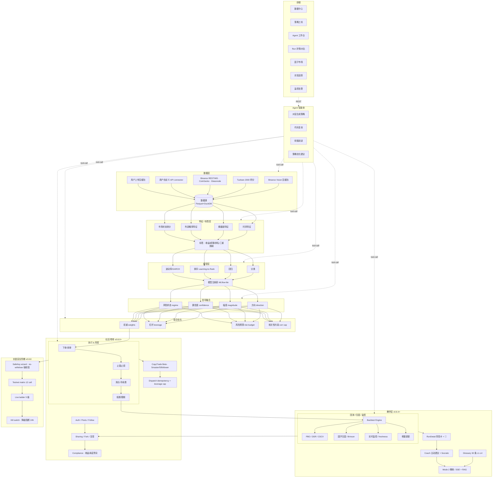

# QuantBT · 全栈量化软件 · 目标提示词 (Goal / PRD v0.2)

> 本文件是把"我想要的量化软件"压缩成一份可以直接喂给 AI 编程代理（Codex / Claude / Cursor / Aider 等）持续推进的 driver prompt。
> 任何承接代理读完它都应能：① 看懂边界 ② 知道当前 QuantBT 仓库已做了什么 ③ 知道下一步该实现什么 ④ 知道用什么数据/库/标准。
> 维护原则：只增不删，决策变了就在原段下追加"v0.x 更新"，保留历史轨迹。

---

## 0. 一句话目标

**做一个面向 A股 + 加密两大市场、Agent 驱动、可上线交付的全栈量化软件**。

终态衡量标准（"可上线成品"= 同时满足以下 6 点）：
1. **能装**：一条命令 / 一个安装包（PyInstaller 或 docker compose up）就能在 Windows / macOS 本机跑起来，无需手工配 Python 环境。
2. **能用**：陌生用户打开后，10 分钟内能完成 ①填 Tushare token 或挂 Binance Vision 目录 → ②跑一个示例策略 → ③看到回测报告。
3. **能造**：用户用对话告诉 Agent "我想做什么"，或粘贴一段策略代码（vnpy / backtrader / pandas 写法），Agent 能生成可执行的 QuantBT 策略并回测出报告。
4. **能信**：每个 run 自动给出 PBO / DSR / Bootstrap Sharpe CI 三项过拟合体检；A股有 Brinson 风格归因、加密有交易成本拆解。
5. **能演进**：
   - **A股**：研究 → 回测 → 仿真（paper trading）三阶就够，**不做**真实下单。
   - **加密**：研究 → 回测 → 仿真 → **Binance 实盘**全链路必须打通。首个上线版本就要能：用户填 Binance API key（read+trade，禁 withdraw）→ 在 testnet 跑通限价单/市价单/止损单 → 在主网用小额（用户自己设上限）真下单。
   首个上线版本不要求"完美的实盘风控"，但要求**安全默认**（详见 §M9）。
6. **能交付**：所有产物（行情、特征、标签、模型、交易、报告）以开放格式（Parquet/CSV/JSON/MD）落盘，用户可独立审计与导出。

---

## 1. 范围与原则

### 1.1 资产范围与执行边界（明确，仅 2 类）

| 市场 | 标的 | 数据 | 执行模式（首个上线版本） |
|---|---|---|---|
| **A股** | 沪深主板 + 创业板 + 科创板 · 指数 / 个股 / ETF | Tushare Pro 日频 + 分钟频（积分允许范围内） | **研究 + 回测 + 仿真（paper trading）**——**不接券商、不下真单**。所有 A股策略 run 只产报告，不连交易接口。 |
| **加密** | 现货 + USDT 永续 | Binance Vision（历史压缩包） + Binance 公开 REST/WS（实时） | **研究 + 回测 + 仿真 + Binance 实盘**——首个上线版本就必须能把策略接到真 Binance 账户下真单。先支持 Binance Spot + Binance USDM Futures。 |

> 明确**不在**范围：美股、港股、外汇、商品期货、期权、债券、做市/HFT、A股实盘对接（券商网关）、其它加密交易所（OKX/Bybit 等留 CCXT 抽象层位置但不交付）。出现 PR 含这些视为偏离，先并主流程。

### 1.2 原则（皆为软目标，仅为保证"可上线"质量；唯一硬约束见 §M15）
- **本地优先**：单机部署是默认形态（FastAPI + Vite + DuckDB/Parquet）；云端是后期可选。
- **免费数据优先**：A股走 Tushare Pro（用户已有 2000 积分 token），加密走 Binance Vision 压缩包 + 实时 REST。付费源（聚宽/米筐/万得）可插拔但绝不进关键路径。
- **Agent 是一等公民**：所有后端能力同时暴露 REST + tool-call schema，Agent 用与 UI 同一套 API 跑通"对话→拉数→生成策略→回测→报告"。
- **可审计**：同代码 + 同 dataset_version + 同随机种子 → 结果可复现（金额 ±1e-6 / 指标 ±1e-4 内）。
- **过拟合证伪是默认动作**：每个策略 run 自动算 PBO / DSR / Bootstrap，UI 上对未通过的打灰标但**不阻塞**。
- **不锁用户**：所有产物落开放格式，用户可独立读写。

### 1.3 唯一硬约束
- **回测详情页冻结**：[`frontend-run-detail/src/pages/RunDetailPage.tsx`](app/frontend-run-detail/src/pages/RunDetailPage.tsx) 的功能与结构不可改，只允许 ①排版 ②显示逻辑 ③加字段 三类改动。详见 §M15。

---

## 2. 参考与差异化

> "专业性"在本项目里有具体定义：方法学严格 + 工程纪律到位 + 不止于教科书示例。下表的每一行都不是装饰，而是必须出现在代码或 UI 里的实际能力。

### 2.1 方法论与机构参考

| 维度 | 参考对象 | 我们抄什么（必须在代码里出现的能力） | 我们做不同的事 |
|---|---|---|---|
| **方法论体系** | **aiquantclaw（AI 量化学院）** | ① 因子五态机 QUALIFIED→PROBATION→OBSERVATION→WARNING→RETIRED + 状态迁移阈值 ② CSCV/PBO 过拟合检验 ③ 白箱算子空间 + 因子模板引擎 + 因子族版本化 ④ AI 参与"需求拆解→逻辑转化→系统重构"全链路 ⑤ 四大流派分类（因子/CTA/套利/ML 量化）作前端导航 | 它是课程，我们是软件——把它教的方法做成可点击 UI 与可调用 API；课程没的（实盘网关、合规、数据接入）我们自己补 |
| **统计套利工程纪律** | **Renaissance Medallion（Simons 系）** | ① 多信号短周期叠加：单信号信噪比低也要拿，靠多样性 + 低相关组合 ② 滚动再训练（≤ 1 个月）而非"训一次跑一年" ③ 严格成本建模（手续费/滑点/冲击/借贷） ④ 风险预算硬约束（单标的/单板块/总杠杆） | 我们不假装能复刻 Medallion 的回报，只把它有据可查的**工程纪律**写进默认行为；不做做市、不做超低延迟 |
| **多策略平台** | **Two Sigma / DE Shaw / Citadel** | ① 因子/策略隔离评估，组合内贡献度可拆 ② Run lineage：每个上线策略都能追到它的训练数据/代码/参数 ③ 风格/行业暴露监控 | 我们做"个人/小团队的多策略"，不做机构级 OMS/PMS |
| **方法学权威** | **Marcos López de Prado · Advances in Financial Machine Learning** | ① **Triple-barrier labeling**（M5 默认标签之一） ② **Meta-labeling**（先方向再仓位） ③ **Purged k-fold + embargo**（M6 默认 CV） ④ **CPCV → PBO**（M10 默认证伪） ⑤ **Deflated Sharpe Ratio**（M10 默认指标） ⑥ **Fractional differentiation**（保留为可选特征） | 把这些方法做成"零配置默认动作"，用户不动手就能拿到；而不是埋在文档让用户自己装 mlfinlab |
| **平台架构** | **Microsoft Qlib** | 数据 handler / 模型 zoo / workflow / experiment tracking 的分层 | 把 Qlib 的 Python-config 驱动换成 Agent + UI 驱动，对非工程用户友好 |
| **因子库起点** | **WorldQuant 101 Alphas** + **Alpha158（Qlib）** | 100+ 经典因子作为内置因子族的初始版本 | 提供"克隆 + 突变"接口让 Agent 派生新因子；每个因子绑定生命周期状态 |
| **A股因子研究** | **国信/广发/中金 等卖方金工经典报告** | 风格因子（市值/价值/动量/反转/质量/盈利/成长/低波）、行业中性化、Barra-style 多因子模型框架 | 内置一组"开箱即用"的风格因子，用户能在 UI 直接看 IC 衰减 |
| **加密专属** | **Glassnode 链上 / Coinglass 衍生品 / Funding rate 套利经典做法** | 资金费率、未平仓量、清算地图、长短比、链上 MVRV/SOPR 作为外部概率特征 | 免费档限频内能跑通；用户能用一个 ticker 看到现货 + 永续 + 链上指标三视图 |
| **数据治理** | **dbt / Great Expectations / Apache Iceberg** | source freshness、column tests（非空/唯一/范围/外键）、snapshot/time-travel、dataset_version 不可变 | 用 DuckDB + Parquet 快照 + 自写 GE-lite，不引入额外运维 |
| **实验追踪** | **MLflow** | run/artifact/model registry，模型阶段 dev→staging→production→archived | 嵌入式 file backend，不起独立服务；前端能看到 lineage 图 |
| **调度** | **Prefect / Dagster（取其轻）** | DAG、依赖、重试、幂等、cron 触发 | 内置百行级迷你调度器；Prefect 作可选适配器 |
| **加密交易抽象** | **CCXT** + **Hummingbot（仅参考思路）** | 统一交易所抽象、订单类型映射、限流与故障转移 | 不做做市、不做 HFT；只做被动限价/市价下单 |
| **A股合规** | **证监会《证券市场程序化交易管理规定（试行）》、沪深交易所实施细则** | 报告管理、系统测试模板、应急方案、异常交易识别（300 笔/秒 或 20000 笔/日 自动标记） | 默认 research-only；用户启用实盘必须显式打开合规模块并 dry-run 通过 |

### 2.2 这套参考映射到代码里的"专业性硬指标"

任何 PR 想通过 review，下面这些"专业性体现"必须在场（非全部，按改动模块对号入座）：

- **任何特征 PR**：必须给 IC / Rank-IC / IC-IR / IC 衰减曲线（5/10/20 日 horizon）
- **任何模型 PR**：必须用 Purged k-fold + Embargo，不允许裸 sklearn train_test_split
- **任何回测 PR**：必须算 PBO / DSR / Bootstrap Sharpe 95% CI；都过不了就在 report.md 显式写"不达专业门槛"
- **任何因子 PR**：必须能进入因子五态机的 NEW 态，并标好它的迁移阈值参数
- **任何 A股策略 PR**：必须做 Brinson 风格归因（市值×行业×风格三层），不允许只给净值曲线
- **任何加密策略 PR**：必须把资金费率 / 借贷利率 / 永续滑点 计入成本，不允许只算 0.04% 手续费
- **任何 Agent 工具调用 PR**：tool schema 必须有完整的 OpenAPI 描述 + 至少一条 e2e 例子

---

## 3. 模块大图



---

## 4. 模块详述（覆盖用户 10 点 + 扩展）

> 注：每节都列【目标】【输入】【输出】【关键技术/库】【MVP 验收】【可选扩展】。
> 路径标记 `app/backend/app/...` 代表我们仓库的现有/规划落地位置。

---

### M1 · 交易目标定义 (用户 #1)

**目标**：把"我想做什么策略"标准化成机器可读的目标函数。

**输入**：用户对话 / 表单 / 上传 YAML
**输出**：`StrategyGoal` 对象（Pydantic），含：
- `asset_class`: `equity_cn` / `crypto_spot` / `crypto_perp` / `mixed`
- `objective`: `max_sharpe` / `max_sortino` / `max_calmar` / `min_drawdown` / `info_ratio` / `custom_python`
- `horizon`: `intraday` / `daily` / `weekly` / `monthly`
- `capacity_usd`: 目标管理规模上限
- `benchmark`: `000300.SH` / `BTC-USD` / `SPX` / `custom`
- `constraints`: turnover_max, single_pos_max, sector_cap, var_max, max_dd
- `cost_model`: 手续费 / 滑点 / 印花税 / 借贷 / 资金费率
- `evaluation_window`: backtest_range + walk_forward_splits

**关键库**：Pydantic v2, YAML, JSON Schema
**MVP 验收**：Agent 能从一句"我想做 A 股周频多头策略，目标年化 20%+，回撤 < 15%"自动填出完整 `StrategyGoal`。
**扩展**：支持多目标 Pareto（年化 vs 回撤）、目标随市场状态切换。

落地位置：`app/backend/app/strategy_goal.py`（待建）

---

### M2 · 资产池与市场状态划分 (用户 #2)

**目标**：把"在哪些标的、在什么市况下交易"显式化。

**输入**：StrategyGoal + 数据源
**输出**：
- `UniverseDefinition`：标的列表（动态/静态）+ 入池规则（市值/成交额/上市天数/ST 过滤/退市保护）
- `RegimeSegmentation`：日级 / 周级的市场状态标签（bull/bear/range/crisis）

**关键技术**：
- A股池：沪深300 / 中证500 / 中证1000 / 全市场过滤
- Crypto 池：Binance USDT 永续 Top-N、市值 + 24h 成交额双过滤
- 状态识别：HMM / Markov / Trend-vs-Range（ADX）/ Vol-cluster / 宏观因子（PMI、CPI、利率）
- Survivorship bias 修复：保留退市/下架历史

**关键库**：`hmmlearn`, `arch`（GARCH 状态机）, `ruptures`（变点检测）
**MVP 验收**：能输出"自 2018-01 至今，沪深 300 成分股动态池 + 4 类市场状态序列"。
**扩展**：跨资产联动状态（美元指数 + A股 + 加密同步状态）。

落地位置：`app/backend/app/universe/`、`app/backend/app/regime/`（✅ v1.0 已建）

**已交付**：
- `universe/`：`UniverseRules`/`UniverseDefinition`（Pydantic）+ `resolve_universe`（按 as-of 解析，截至当日数据 → point-in-time，喂入保留退市历史的面板即幸存者偏差安全）+ `resolve_universe_series`（逐再平衡日成分）+ 排序取 top_n + 上市天数/最低成交额/最低价/ST/排除过滤 + 3 个数据驱动预设（全市场 / 流动性 Top300 / 加密 Top30）。规则字段名对齐 canonical（amount/close），跨 A 股与加密通用。
- `regime/`：`detect_regime`（Wilder ADX 平滑判趋势强度 + +DI/-DI 判方向 + 收益率波动率 z-score 判 crisis）→ `(ts, regime, adx, plus_di, minus_di, vol_z)`，`regime ∈ {bull,bear,range,crisis}`，`select(["ts","regime"])` 直喂 M7 `apply_regime_gating`（已有集成测试）。`RegimeConfig` 阈值可调。
- 依赖轻量：仅 numpy/polars，**未引** hmmlearn/arch/ruptures（环境未装）。HMM/GARCH/变点检测留作可插后端。
- 18 个单测（regime 8 + universe 10），含幸存者偏差、阈值生效、空输入、缺列报错、喂 M7 gating。

**未做（按需扩展）**：HMM/GARCH 状态后端（需装 hmmlearn/arch）；沪深300/中证500 等指数成分通过 Tushare `index_weight` 注入 `static_symbols`；宏观因子（PMI/CPI/利率）regime。

---

### M3 · 数据接入、清洗与对齐 (用户 #3 + 用户原话核心)

**目标**：把"数据"变成不再卡脖子的工程问题。

**支持的接入方式（按优先级）**：

| 类型 | 来源 | 实现策略 | 限制处理 |
|---|---|---|---|
| 加密压缩包（**主**） | **Binance Vision** (https://data.binance.vision) | 已实现 `binance_vision_pull.py`；扩展支持现货 + USDT 永续 1m/1h/1d 全历史 + 资金费率 | 无限流，磁盘大 → 增量 + 去重 + 压缩 |
| 加密实时 | Binance REST / WS（公开行情即可，不需私钥） | 增量补今日 K 线、资金费率 | 速率限制按官方 1200 weight/min |
| A股（**主**） | **Tushare Pro (2000 积分 token)** | 已有 `data_pull.py` 集成；**关键：约 500 次/分钟 + 单接口约 200 次/分钟**，需令牌桶 + 退避 | 命中限流自动 sleep + 提示降级 |
| 加密辅助 | CoinGecko / Glassnode 免费档 | 横截面市值、链上指标作为外部概率特征 | 免费档限频，缓存 24h |
| 用户自定义 API | 用户填表：base_url + auth + 分页 + 字段映射 | YAML connector 模板 + Jinja URL + JsonPath 映射 | 用户负责合规 |
| 用户上传 | zip/tar/parquet/csv 拖拽 | UI + 后端 `/api/data/upload` | schema 推断 + 字段映射向导 |

**数据治理（最小必要集）**：
- **统一 schema**：所有行情归一为 `(ts, symbol, market, interval, open, high, low, close, volume, amount, ...)`，时区统一 `UTC` 存储，A股展示用 `Asia/Shanghai`。
- **对齐**：A股日历 `pandas_market_calendars` 的 `XSHG/XSHE`；加密 24/7 无日历，按 `ts` 直接 join。
- **复权**：A股双轨——存"未复权 + 复权因子"，绘图按前复权，回测按后复权或动态复权。加密无此问题。
- **清洗**：NaN 策略（前向 N 步 / 同板块均值 / 标记缺失）、异常值（rolling z-score > 5 标记）、停牌处理。
- **快照**：每次拉数生成 `dataset_version`，记录 source/url/checksum/row_count/coverage；后续 run 引用版本号而不是路径。
- **freshness**：`/api/data/freshness` 给出每个数据集的"最后更新 vs 应有更新"差距，UI 显示绿/黄/红。
- **data tests**：每个数据集落 5 条以内 GE-lite 规则（非空、单调、范围、去重、外键）。

**关键库**：`polars`, `duckdb`, `pyarrow`, `pandas_market_calendars`, `tenacity`（重试）, `pydantic`
**MVP 验收**：
- Binance BTCUSDT 1m 全历史能一键下载 + 增量 + 落 Parquet
- Tushare 沪深 300 日频自 2010 起入库，命中限流自动退避
- 用户上传一个 zip（含 csv）能在 UI 看到 schema、预览前 100 行、入库
- 任何 run 引用数据时显示"dataset_version + freshness"

落地位置：`app/backend/app/data_pull.py`（已部分）、`app/backend/app/connectors/`（待建）、`app/backend/app/data_quality.py`（待建）

---

### M4 · 特征工程（时序 + 横截面 + 外部概率） (用户 #4)

**目标**：把"原始行情"变成"模型能吃的特征矩阵"，并支持因子工厂规模化。

**三层特征**：

| 层 | 例子 | 实现路径 |
|---|---|---|
| **时序** (per-symbol time-series) | 收益率 (1d/5d/20d)、波动率、动量、均线偏离、RSI/MACD/BOLL、价量背离、订单簿不平衡（crypto）、资金费率（perp） | `app/backend/app/features/ts.py` |
| **横截面** (per-date cross-section) | 截面市值、PE/PB/PS、行业相对强度、动量分位、流动性分位、Beta、残差动量 | `app/backend/app/features/xs.py` |
| **外部概率** (external signal) | 期权隐含波动率（VIX/BVOL）、新闻情感、社交媒体情感、宏观（PMI/CPI/利率）、链上数据（地址数/算力/MVRV）、衍生品持仓（CFTC COT） | `app/backend/app/features/exo.py` |

**因子工厂工程化（来自 aiquantclaw）**：
- **白箱算子空间**：定义 `+ - * / log exp lag delta sum mean std rank zscore ts_corr ts_argmax` 等 ~40 个算子。
- **模板引擎**：用 AST/表达式树定义因子（例 `rank(ts_corr(close, volume, 20))` ≈ Alpha#6），Agent 可生成新表达式。
- **批量计算**：polars 向量化 + DuckDB 跨日期合并；万级因子在 10 年沪深 300 上 <5 分钟。
- **版本化**：每个因子有 `factor_id + version + formula + author + birth_date + lifecycle_state`。
- **生命周期**：`QUALIFIED → PROBATION → OBSERVATION → WARNING → RETIRED`，对应 IC / IR / 衰减阈值自动迁移。

**关键库**：`polars`, `duckdb`, `numpy`, `numba`（热点加速）, `pyarrow`
**MVP 验收**：
- 内置 WorldQuant Alpha101 中 30 个易实现的
- 因子表达式可在 UI 直接写 `rank(ts_corr(close,volume,20))` 并跑出 IC 曲线
- 每个因子有生命周期看板
**扩展**：基于 GP/遗传算法的因子挖掘（gplearn 改造）；图神经网络因子（行业-个股关系图）。

落地位置：`app/backend/app/features/`、`app/backend/app/factor_factory/`（待建）

---

### M5 · 标签构建（收益 / 超额 / 排名 / 三重障碍） (用户 #5)

**目标**：把"未来要预测什么"做成可配置的 label 函数。

**支持的标签类型**：

| 标签 | 公式 | 用途 |
|---|---|---|
| Raw return | `r_{t→t+h} = close[t+h]/close[t] - 1` | 回归 |
| Excess return | `r_strategy - r_benchmark` | A股 alpha 模型 |
| Cross-sectional rank | `rank(r_{t→t+h})` 截面内 | learning-to-rank |
| Triple Barrier (López de Prado) | 同时设上沿 (TP)、下沿 (SL)、时限 (T)，触发哪个就标哪个 | 分类（多头/空头/超时）|
| Meta-labeling | 先 base model 出方向，再 meta 决定是否下单 | 提高胜率 |
| Volatility-adjusted return | `r / σ_ewma` | 跨标的可比 |

**关键库**：`mlfinlab`（其 triple-barrier 实现）；如不引入则自写一个 100 行内的等价实现到 `app/backend/app/labels/triple_barrier.py`
**MVP 验收**：能为同一份特征矩阵生成 5 种标签，并各自跑出基线模型。
**扩展**：动态 barrier（基于实时波动率自适应）；多 horizon 联合标签。

---

### M6 · 模型训练（分类 / 回归 / 排序 / 波动率） (用户 #6)

**目标**：把"特征+标签"训成稳健的预测模型，强制做样本外控制。

**模型清单（按优先级）**：

| 任务 | 默认模型 | 备选 |
|---|---|---|
| 二/三分类 | **LightGBM** + 类权重平衡 | XGBoost / CatBoost / Logistic |
| 回归 | **LightGBM regressor** | ElasticNet / Ridge / TabNet |
| 排序 | **LightGBM lambdarank** | XGBoost ranker |
| 波动率 | **GARCH(1,1) + EWMA** | HAR-RV / NN-vol / `arch` 包 |
| 时序深度 | LSTM / Temporal Fusion Transformer | 仅在数据量足够 + 显式开启时启用 |

**验证协议（绝不妥协）**：
- **Walk-forward**：滚动窗口训练 + 不重叠测试段
- **Purged k-fold + embargo**：避免标签泄漏（López de Prado）
- **Combinatorial Purged CV**：用于计算 PBO
- **Hyperparameter search**：Optuna，但限制 `n_trials` 与"最优 ≠ 上线"，必须叠加稳定性测试
- **样本外退化检测**：训练集 Sharpe vs OOS Sharpe 衰减 > 50% 触发 WARNING

**关键库**：`lightgbm`, `xgboost`, `scikit-learn`, `arch`, `optuna`, `mlfinlab`（CPCV）, `pytorch`（按需）
**MVP 验收**：
- 一份 demo 配置能在 10 分钟内训出 LGBM 分类 + 报告 OOS IC / Sharpe / PBO
- 训练全过程登记到 MLflow-lite，可在前端 Run 详情看到

落地位置：`app/backend/app/models/`（待建）

---

### M7 · 信号融合（方向 / 幅度 / 置信度 / 风险状态） (用户 #7)

**目标**：把若干模型输出整合成一个清晰的"信号四元组"。

**信号 schema**：

```python
class Signal:
    ts: datetime
    symbol: str
    direction: Literal["long", "short", "flat"]    # +1 / -1 / 0
    magnitude: float          # 0..1 建议仓位强度
    confidence: float         # 0..1 模型自信度（校准后概率）
    regime: str               # "bull"/"bear"/"range"/"crisis"
    contributing_factors: list[FactorAttribution]   # 哪些因子推上去的
```

**融合策略**：
- **stacking**：多个 base model → meta model 投票
- **regime-gated**：bear 时禁用动量、bull 时禁用反转
- **confidence-thresholding**：低置信度直接 flat，避免过度交易
- **calibration**：Platt scaling / isotonic 把概率校准成可比口径

**关键库**：`scikit-learn.calibration`, `mlxtend.stacking`
**MVP 验收**：相同模型在 regime-gated 模式下，最大回撤至少降 20%。

---

### M8 · 组合优化（权重 / 杠杆 / 风险预算 / 相关性约束） (用户 #8)

**目标**：把信号转成"具体仓位"，受到风险预算 + 相关性 + 容量约束。

**支持的优化方法**：

| 方法 | 用途 |
|---|---|
| **Mean-Variance (Markowitz)** | 基线 |
| **HRP (Hierarchical Risk Parity)** | 协方差不稳的小样本，鲁棒 |
| **Risk Parity** | 风险等权 |
| **Black-Litterman** | 主观观点 + 市场均衡先验 |
| **CVaR optimization** | 尾部风险敏感 |
| **Kelly / Fractional Kelly** | 加密 / 高频，但限制 fraction ≤ 0.25 |

**约束（首发必须支持）**：
- 单标的最大权重 (`single_pos_max`)
- 多空各侧总权重
- 行业 / 板块上限
- turnover penalty
- 流动性约束（成交额前 N 日中位数 × k）
- 相关性约束（pair-wise corr > 0.85 二选一）
- 杠杆上限（实盘默认 1.0，仿真可放开）

**关键库**：`riskfolio-lib`, `cvxpy`, `PyPortfolioOpt`, `numpy`
**MVP 验收**：相同信号在 MVO vs HRP 下能跑出不同权重并对比。
**扩展**：在线再平衡（增量 QP）、加密永续资金费率对冲、A股 ETF 对冲组合 beta（沪深 300 ETF 替代股指期货）。

落地位置：`app/backend/app/portfolio/`（待建）

---

### M9 · 执行与风控（下单 / 止盈止损 / 滑点 / 手续费 / 熔断） (用户 #9)

**目标**：让回测和实盘共用一套执行抽象，**回测假设 ≈ 实盘行为**。A股仅到仿真层；加密必须到 Binance 真实盘。

---

#### M9.1 执行抽象（A股 + 加密共用）

统一接口（伪代码）：

```python
class ExecutionVenue(Protocol):
    def place_order(self, order: Order) -> OrderAck: ...
    def cancel_order(self, order_id: str) -> CancelAck: ...
    def get_position(self, symbol: str) -> Position: ...
    def get_balance(self) -> Balance: ...
    def stream_executions(self) -> AsyncIterator[ExecutionReport]: ...
```

实现：
- `BacktestVenue`：回测撮合（向量化 + 事件驱动两种）
- `PaperVenue`：实时行情 + 模拟成交，A股 / 加密通用
- `BinanceSpotVenue` / `BinanceUMFuturesVenue`：加密真实盘
- A股**不实现** LiveVenue（不接券商）

---

#### M9.2 回测撮合（A股 + 加密共用）

- 撮合模式：next-bar-open（保守 / 默认）/ VWAP / TWAP / 限价模拟
- A股成本：佣金 0.025% 双边 + 印花税 0.1% 卖出 + 过户费 0.001% 双边（参数化）
- 加密成本：
  - Spot：maker 0.10% / taker 0.10%（VIP 0 默认），BNB 抵扣 25% 可配
  - USDM Perp：maker 0.02% / taker 0.04%（VIP 0 默认）+ **每 8 小时资金费率**（用真实历史费率，不可省略）
- 滑点模型：① 固定 bp ② 线性（成交量/ADV × bp）③ 平方根冲击 ④ 基于真实 orderbook 深度模拟（加密推荐）
- 流动性约束：单笔成交 < 当时档位深度 × k；A股加 "单笔 < 当日成交额 × 10%" 软约束
- 三档成本模型预设：乐观 / 中性 / 悲观，UI 一键切换；报告必须同时给出三档结果对比

---

#### M9.3 加密实盘（Binance）——专业性硬指标

> 这一节决定加密策略能不能上线，所有要点都必须实现，**不允许**简化为"先接个 CCXT 跑通就行"。

**A. 订单类型（首版必须支持的）**

| 市场 | 必须支持 | 可选扩展 |
|---|---|---|
| Spot | `LIMIT` / `MARKET` / `STOP_LOSS_LIMIT` / `TAKE_PROFIT_LIMIT` / `LIMIT_MAKER`（post-only） / **OCO** | `ICEBERG_QTY` / `TRAILING_STOP` |
| USDM Futures | `LIMIT` / `MARKET` / `STOP` / `STOP_MARKET` / `TAKE_PROFIT` / `TAKE_PROFIT_MARKET` / `TRAILING_STOP_MARKET` + `reduceOnly` / `closePosition` / `workingType=MARK_PRICE\|CONTRACT_PRICE` | 多层止盈 / 网格 |

**B. 仓位与杠杆管理（仅 USDM Futures）**

- **保证金模式**：cross / isolated 切换；UI 显式展示，默认 isolated（更安全）
- **杠杆**：上线初版**强制上限 5x**，用户可在 settings 显式放开到 20x；> 20x 直接拒绝
- **仓位模式**：one-way / hedge 模式（双向持仓）；默认 one-way，hedge 模式要在 settings 显式打开
- **强平风险监控**：实时计算 liquidation price 和到强平的距离（mark price 距 liq price < 5% 时 UI 红条）
- **ADL（自动减仓）告警**：从 WS userDataStream 监听 ADL 队列位置

**C. API key 安全（**绝对**不可妥协）**

- 启动时调 `GET /sapi/v1/account/apiRestrictions`（Spot）和 `GET /fapi/v1/apiKey/permissions`（Futures），**确认无 withdraw 权限**；有则**拒绝启动**并在 UI 显示红框警告
- 必须开 IP 白名单（Binance 端用户操作 + 软件检测）；软件检测当前公网 IP 不在白名单时给出明确提示但不阻断
- API key / secret 落本地加密存储（`keyring` 或 AES + 用户主密码），**绝不**入数据库明文、**绝不**入日志
- testnet / mainnet 切换在 UI 顶部用大色块显示（testnet 绿、mainnet 红），切换需要二次确认
- 全部交易动作走 `clientOrderId` 幂等键，防止网络抖动重复下单
- `recvWindow` 默认 5000ms，启动时做 `GET /api/v3/time` 校时

**D. 网络韧性**

- REST：基于 `httpx` + `tenacity`，指数退避 + 上限重试；429 / 418 立即停 60s
- WebSocket：用户数据流（userDataStream）必须用，listenKey 每 30 分钟 PUT 续期；断连指数退避重连
- 订单状态对账：每 N 分钟一次"我本地认为的活动订单"vs"`GET /openOrders` 返回"对账，发现孤儿订单自动 reconcile
- 部分成交：`executionReport` / `ORDER_TRADE_UPDATE` 增量推送 → 本地仓位实时更新；不依赖 REST 轮询
- Symbol filter 自动遵守：启动时拉一次 `exchangeInfo`，本地缓存 `PRICE_FILTER` / `LOT_SIZE` / `MIN_NOTIONAL`，下单前自动 quantize（向下取整价格/数量）

**E. 实盘风控（运行期硬约束）**

| 层 | 控制点 | 默认值 / 行为 |
|---|---|---|
| 启动前 | API key 权限校验（无 withdraw） | 不通过则拒绝启动 |
| 启动前 | 杠杆上限校验 | > 5x 需用户显式确认 |
| 下单前 | 单笔金额上限（USDT） | 默认 100 USDT，用户可在 settings 改 |
| 下单前 | 单笔数量与最小名义价值校验 | 自动 quantize；不达 `MIN_NOTIONAL` 拒单 |
| 下单前 | "肥手指"保护：限价偏离 mark price > X% 拒单 | X 默认 2% |
| 下单前 | 黑名单 symbol（用户在 settings 配） | 命中拒单 |
| 运行中 | 单日下单笔数上限 | 默认 200，超过暂停接受新信号 |
| 运行中 | 单日累计亏损上限（USDT 或 %） | 默认 -5%，触发后自动撤销所有挂单 + 拒绝新单 |
| 运行中 | 持仓集中度 | 单 symbol 仓位 < 账户净值 × 30% |
| 运行中 | 异常行情熔断 | 标的 mark price 10 分钟变动 > σ × 5 → 暂停该 symbol |
| 运行中 | 强平距离监控 | < 5% 时 UI 红条 + WS 推送告警 |
| 一键键 | **Kill Switch** | 顶部红按钮：撤销所有 + 市价平所有 + 拒绝新单 |

**F. 资金费率与基差**

- 永续资金费率：从 `/fapi/v1/premiumIndex` 拉实时与下一期预测，UI 显示
- 资金费率历史：从 `/fapi/v1/fundingRate` 拉，作为外部概率特征供 M4 使用
- 基差监控：spot vs perp 价差，作为现货-永续套利策略的信号源（可选 P2 模块）

**G. 成本对齐**

实盘每笔成交后必须把"实际成本"和"回测假设成本"做差异分析，每周累积偏差 > 阈值时报告里给出"实盘 vs 回测成本偏离"指标。

**关键库**：
- `python-binance`（官方 Python SDK）或 `binance-connector-python`（Binance 官方 connector）
- `ccxt`（抽象层，留扩展 OKX/Bybit 的位置，但首版只接 Binance）
- `websockets` / `aiohttp`（自管 WS）
- `keyring`（密钥安全存储）

---

#### M9.4 A股仿真（paper trading）

A股**不接券商**。只做：
- 撮合：用回测同一套撮合器 + Tushare 实时日内数据
- 假成交：根据下一根 1m K 线的 open/high/low/close 决定假成交价（保守用 next-bar-open）
- 资金账户：本地 SQLite 维护，每日 mark-to-market
- 报告：和回测同一份产物，UI 上加"PAPER"标签

---

**MVP 验收**：
1. 回测能在同一份信号下切换乐观/中性/悲观三档成本模型，三份指标都进 report.md
2. 加密策略能切换 testnet / mainnet；testnet 上跑通 Spot limit/market/OCO + Futures limit/market/stop/reduceOnly 全部订单类型
3. API key 启动校验：故意挂一个开了 withdraw 权限的 key，软件**拒绝**启动并给出明确报错
4. WS 断连模拟（拔网线 10 秒再插回）后订单状态自动对齐，不出现孤儿订单
5. Kill Switch 点击后 < 2 秒撤销所有挂单 + 平所有仓位
6. A股策略 run 标签明确显示 "PAPER"，不存在任何券商网关代码路径

落地位置：
- `app/backend/app/execution/binance_spot.py`
- `app/backend/app/execution/binance_um_futures.py`
- `app/backend/app/execution/paper.py`
- `app/backend/app/execution/backtest.py`
- `app/backend/app/risk/`（pre/at/post-trade checks + kill switch + 监控）
- `app/backend/app/security/keystore.py`（加密密钥存储）

---

### M10 · 回测、归因、上线监控、增量更新 (用户 #10)

**目标**：让"研究→上线→运行"全程不变形。

**回测引擎要求**：
- 单 run 在沪深 300 + 10 年日频 < 60 秒（polars + numpy 向量化）
- 支持事件驱动（订单逐笔）与向量化（仓位逐日）两种模式
- 输出标准产物（已对齐当前 QuantBT 格式 `data/artifacts/experiments/{run_id}/`）：
  - `run.json` 元数据
  - `portfolio.csv` 权益曲线
  - `trades.csv` 成交
  - `positions.csv` 持仓
  - `attribution.csv` 归因
  - `report.md` 自动报告
  - `metrics.json` 全套指标
  - `dataset_versions.json` 数据快照引用

**归因（强制产出）**：
- 单因子贡献分解
- Brinson 行业/风格归因（A股）
- 多空贡献 / 持仓时长贡献 / Top/Bottom 桶贡献
- 成本拖累分解（手续费 / 滑点 / 印花税）

**指标体系（指标页全覆盖）**：
- 收益：累计 / 年化 / 月度热力图
- 风险：波动率 / 下行波动率 / 最大回撤 / 回撤区间
- 风险调整：Sharpe / Sortino / Calmar / Information Ratio
- 稳定性：滚动 Sharpe / 滚动 IC / Hit rate
- **过拟合**：**PBO**（Probability of Backtest Overfitting）/ **DSR**（Deflated Sharpe Ratio）/ **CSCV**
- 交易行为：换手率 / 持仓时长 / 胜率 / 盈亏比

**上线监控（live mode）**：
- 数据新鲜度（每日开盘前 / 每分钟）
- 信号漂移：今日 IC vs 训练期 IC 的 z-score
- 模型衰减：滚动 30 天 Sharpe vs 上线时 Sharpe
- 异常交易报警：单笔/日内/日累超阈

**增量更新**：
- 数据：按 `dataset_version` 增量入库
- 特征：因子表达式不变时只算新日期
- 模型：滚动窗口到期自动重训 + 灰度（旧模型权重 0.5 → 0）
- run 复算：用户改一行代码后能"基于历史数据快照"快速重跑

**关键库**：`mlfinlab`（PBO/DSR/CSCV）, `quantstats`（图表）, `pyfolio`（部分）
**MVP 验收**：
- 现有 demo run 加跑 PBO/DSR/CSCV，结果展示在 RunDetail 概览
- 模型衰减监控能在前端给出"过去 30 天 Sharpe 下降 50%"红条

---

### M11 · 因子生命周期管理（aiquantclaw 扩展）

**状态机**：

```
NEW   →  QUALIFIED  →  PROBATION  →  OBSERVATION  →  WARNING  →  RETIRED
          ↑ pass             ↑ live trial     ↑ degrade
          IC>x, IR>y          OOS>z%           drift
```

**自动迁移规则**（示例，参数化）：
- `NEW → QUALIFIED`：IC > 0.03 且 IR > 0.5 且 t > 3
- `QUALIFIED → PROBATION`：连续 3 个月 IC 不为负
- `PROBATION → OBSERVATION`：模拟实盘 1 个月年化 > 基准
- `OBSERVATION → WARNING`：30 天 IC 衰减 > 50%
- `WARNING → RETIRED`：连续 2 周 WARNING 不能修复
- 退役因子保留只读副本，可被新版本"重启"为 `NEW`

落地位置：`app/backend/app/factor_factory/lifecycle.py`（待建）+ UI 因子市场页

---

### M12 · 实验系统与模型注册表

**目标**：每个 run 都能溯源、对比、晋级。

**实体模型**：

```
Experiment（实验组）
 └── Run（一次执行）
      ├── inputs:  dataset_version + factor_set_version + model_config
      ├── outputs: portfolio.csv / trades.csv / metrics.json / report.md
      ├── tags:    {regime, asset_class, lifecycle}
      └── lineage: parent_run_id / forked_from
ModelRegistry
 └── Model
      └── Version
           ├── stage: dev | staging | production | archived
           ├── metrics: {sharpe, pbo, dsr, ic, ir}
           └── artifacts: weights + code + config
```

**实现策略**：嵌入式 MLflow（不起独立服务，直接读 SQLite）。对外暴露简洁 REST：
- `POST /api/experiments`
- `POST /api/runs`（已有，扩展元数据）
- `GET /api/runs/compare?ids=...`（已有）
- `POST /api/models/{id}/promote`

**关键库**：`mlflow`（嵌入式 / file backend）
**MVP 验收**：能在前端看到 run lineage 图，并把任一 run 晋级到 staging。

---

### M13 · 任务编排与调度

**目标**：把"研究 / 拉数 / 训练 / 上线 / 监控"组织成可重放的 DAG。

**最小实现**：内置 `JobStore`（当前已有 InMemoryJobStore）扩展为：
- DAG 定义：YAML 或 Python 装饰器
- 触发：cron / 事件 / 手动
- 依赖、重试（指数退避）、超时、幂等键
- SLA：超时告警

**外部适配**：
- 可选 Prefect / Dagster 适配器（仅在用户有需求时启用）

**示例 DAG**：

```yaml
name: daily_a_share_pipeline
schedule: "30 17 * * 1-5"   # 收盘后 30 分钟
tasks:
  - id: pull_daily
    op: data.pull
    params: {source: tushare, kind: stock_daily}
  - id: pull_index
    op: data.pull
    params: {source: tushare, kind: index_daily}
  - id: compute_features
    deps: [pull_daily, pull_index]
    op: features.compute
    params: {factor_set: hs300_top30_v3}
  - id: predict
    deps: [compute_features]
    op: model.predict
    params: {model_id: lgbm_xs_v5/production}
  - id: optimize
    deps: [predict]
    op: portfolio.optimize
    params: {method: hrp, max_pos: 0.05}
  - id: report
    deps: [optimize]
    op: report.daily
```

落地位置：`app/backend/app/jobs.py`（扩展）、`app/backend/app/dag/`（待建）

---

### M14 · Agent 智能体（核心差异化）

**目标**：让用户用对话 / 上传代码 完成全流程，不需要写 Python。

#### 14.1 Agent 形态
- **对话生成策略**：自然语言 → 槽位补全 → StrategyGoal → 因子/模型/优化器选型 → 自动 run
- **代码复刻**：用户粘贴一段策略代码（vnpy / backtrader / 米筐 / 自写 pandas）→ Agent 解析 → 改写成 QuantBT 标准模板 → 一键回测
- **研报阅读**：用户上传 PDF/MD → Agent 抽取规则 → 提议复现实验
- **策略优化建议**：基于 run 结果给改进建议（降换手、加 regime 门、换标签、改 horizon）

#### 14.2 工具调用清单（Agent 可见的 tool schema）

| 工具 | 描述 |
|---|---|
| `data.list_sources` | 列出可用数据源、字段、freshness |
| `data.pull` | 触发拉数 |
| `data.upload` | 用户上传压缩包后注册 |
| `universe.define` | 创建标的池 |
| `factor.create_expression` | 表达式因子 |
| `factor.run_ic` | 计算 IC / IR |
| `label.build` | 生成标签 |
| `model.train` | 训练模型 |
| `signal.fuse` | 信号融合 |
| `portfolio.optimize` | 组合优化 |
| `backtest.run` | 跑回测 |
| `eval.pbo` / `eval.dsr` | 过拟合检测 |
| `attribution.brinson` | 归因 |
| `report.generate` | 自动 MD 报告 |
| `experiment.compare` | 对比 N 个 run |

#### 14.3 对话样板（Agent 工作台示意）

```
User: 我想做一个 A 股周频选股策略，目标 top10% 个股，回撤控制在 20% 以内
Agent: 我建议从 hs300 + zz500 池子起步，先用动量/反转/价量背离 + 截面分位特征。
       目标函数 = max IR，with max_dd_constraint=20%。
       是否同意？我开始拉 2015 起的日频数据。
User: 同意，但只在牛市 + 震荡用动量，熊市用反转
Agent: ✅ 已切到 regime-gated 模式（HMM 4 态识别），开始执行……
       [tool: data.pull tushare daily 2015-01..now]
       [tool: factor.create_expression mom_20 = rank(close/lag(close,20)-1)]
       [tool: factor.run_ic on hs300]
       结果：mom_20 IC=0.041, IR=0.71，已迁入 QUALIFIED。
       继续训练 LGBM lambdarank？
User: 好
Agent: [tool: model.train ...]
       [tool: backtest.run ...]
       PBO=0.08（健康），DSR=0.92，OOS Sharpe=1.42，最大回撤 -14.3%
       报告：runs/auto-2026-05-28-001/report.md
```

#### 14.4 实现技术
- **后端**：FastAPI 暴露 OpenAPI；Agent 端用 Claude / GPT-4 / Qwen 三选一，统一 `LLMClient` 抽象
- **编排**：LangGraph / 自写状态机；slot-filling + reflection + reAct
- **代码复刻**：AST + libcst 改写；先做"提取信号生成函数 → 包成 `predict()` → 接入 QuantBT runner"
- **沙箱**：用户代码必须跑在受限 sandbox（`subprocess` + 资源限制 + 网络白名单）
- **审计**：每次 tool-call 落 trace，可重放

落地位置：`app/backend/app/agent/`、`app/frontend/src/pages/AgentChat.tsx`（待建）

---

### M15 · 前端架构

**目标**：在不破坏当前已做好的 `frontend-run-detail` 收益概述页（用户已确认冻结）的前提下，扩展到完整工作台。

> ⚠️ **硬约束 · 回测详情页冻结**（用户 2026-05-28 两次强调）：
> `frontend-run-detail/src/pages/RunDetailPage.tsx` 及其引用组件（`JqDailyHoldingsPanel` / `JqTradesPanel` / `jqOverviewSummary.ts`）的功能与结构已冻结。允许的改动只有 3 类：
> 1. **排版优化**（间距、对齐、字号、配色、栅格、响应式断点）
> 2. **显示逻辑优化**（tooltip 格式、dataZoom 行为、数值格式化、空态/加载态、标签文案）
> 3. **添加字段**（在现有指标板、表格、tooltip、归因区追加新指标/列；或在左侧 sidebar 加新 tab）
>
> **禁止**：删 tab / 删指标块 / 改三联图 grid 像素布局常量 / 整体重写 / 合并到其它 SPA / 以"统一组件库"为由侵入式重构。任何 PR 必须先标明改动属于上面 3 类之一。

**页面规划**：

| 页面 | 位置 | 状态 |
|---|---|---|
| 数据中心（来源 / 标的池 / 上传 / freshness） | `frontend-data-center` | 已有骨架，待扩展 freshness 与上传向导 |
| 策略工坊（StrategyGoal 表单 + 因子表达式编辑器） | 新建 | 待建 |
| Agent 工作台（对话 + 工具调用可视化） | 新建 | 待建 |
| Run 详情（收益概述三联图） | `frontend-run-detail` | **冻结**（仅允许排版/显示逻辑优化/加字段） |
| Run 对比 | `frontend` 的 ComparePage | 已有 |
| 因子市场（生命周期看板） | 新建 | 待建 |
| **Binance 交易台**（API key 管理 + 仓位 / 订单 / 实时 PnL / Kill Switch） | 新建 | 待建（加密实盘核心） |
| **风控驾驶舱**（强平距离 / 资金费率曲线 / 24h 异常 / 黑名单管理） | 新建 | 待建 |
| 实验追踪（lineage 图） | 新建 | 待建 |
| 监控告警（freshness/漂移/熔断） | 新建 | 待建 |

**技术栈**：保持 Vite + React + TypeScript + ECharts + react-query；后续按需增加 `@tanstack/react-table`、`reactflow`（lineage 图）、`monaco-editor`（因子表达式）。

**多前端关系**：目前 3 个 SPA 并存（已盘点），下阶段考虑：
- 方案 A：保持 3 个独立 SPA + 统一顶部导航（路径式跳转），开发隔离强
- 方案 B：合并为 monorepo + 共享 packages/ui（首选，等组件库稳定再做）

---

### M16 · 社区 + 策略分享（v0.8.0 落地）

- **目标**：让用户从"自己跑回测"演化到"看别人怎么跑、Fork、对比、复现"
- **输入**：用户 auth (sqlite users 表) + run.json metrics snapshot
- **输出**：Square 风 feed + 策略广场 leaderboard + 用户主页 + 关注关系图
- **关键库**：自写 sqlite + PBKDF2-HMAC-SHA256 (无 bcrypt 依赖) + bearer token sessions
- **MVP 验收**：注册 → 发帖（含 #tag + attached_run_id）→ 收到关注 → 复制别人的 run 跑出同样结果
- **可选扩展**：Markdown 评论嵌套、@mention 通知、weekly recap

### M17 · 私域带单 CopyTrade（v0.8.1 + v0.8.9 落地）

- **目标**：master 发 signal → 给 active follower 真下 Binance 单，但 master 永远拿不到 follower 凭证
- **输入**：master 风控参数 + follower 自填 keystore_name + per_order_max_usdt + daily_loss_pct + max_leverage
- **输出**：5 表 (ct_masters / ct_followers / ct_signals / ct_executions / ct_dispatches) + invite_code 旋转
- **关键库**：复用 M9 SignalRelayer + RiskMonitor + SecureKeystore（每个 follower 走自己 key）
- **MVP 验收**：
  - master 发 STOP_MARKET → 3 个 follower 各自跑自己 RiskMonitor → 各自下到自己 Binance venue
  - 私域 invite_only → 用户必须先 redeem invite_code 才能订阅
  - **v0.8.9**：dispatch idempotency (signal_id+follower_id UNIQUE) + leverage hard cap (master 10x → follower cap 2x)
- **生产边界**：5 master / 50 follower beta 上限（patch2 §A.f 法律风险考虑）

### M18 · 聚宽风 IDE + BigQuant 风 AI 辅助 + 沙箱（v0.8.2-v0.8.3 落地）

- **目标**：浏览器内用户自己写 Python 策略 → 子进程沙箱跑 → emit_result 落到正式 Run pipeline
- **输入**：用户在 IDE 写的 Python 代码（含 `quantbt.emit_result({equity_curve: [...]})` 协议）
- **输出**：runs/<id>/{portfolio.csv, run.json, strategy.py, stdout.log, stderr.log}
- **关键库**：subprocess + resource.setrlimit + isolated python (-I) + socket/subprocess/os.system/chdir monkey-patch
- **MVP 验收**：
  - 用户提交访问 socket 的代码 → sandbox 抛 PermissionError
  - 提交 emit_result 含 equity_curve → promote 后 RunDetail 三联图能渲染
  - AI write/explain/fix 三模式 + 注入 ai_context (connector/factor/operator/沙箱规则)
- **已知限制**：sandbox 非 hardened（patch1 §G.b 8 个攻击向量待 v0.9.x 容器化）

### M19 · Glossary + Mode 2 教学 Agent（v0.8.4-v0.8.6.1 落地）

- **目标**：让用户**理解**策略结果可信度（PBO/DSR/MaxDD/IC-IR），而不是只盯收益曲线
- **输入**：30 条 markdown 词条 (frontmatter + L1-L4 渐进披露) + active_run metrics + conversation history
- **输出**：
  - `/api/glossary/{term}?level=l1|l2|l3|l4` 渐进披露
  - `/chat` 多轮 SSE + RAG (BM25 + 关键词 + recency) + 5 步状态机
  - RunDetail 风险卡 (4 档 trust_level) + 7 条触发规则
  - Coach 主动建议 (按 risk_summary flag 浮出"我帮你诊断 →")
- **关键模块**：
  - `glossary/loader.py` Pydantic schema + parser + registry
  - `agent/conversations.py` ChatService (sqlite chat_conversations + chat_messages)
  - `agent/rag.py` 混合 retrieval
  - `agent/coach.py` SOCRATIC_DECISION + suggest_from_risk_summary
  - `agent/prompts/mode2_teaching.py` 完整 system prompt + 11 条 contract test
  - `eval/risk_summary.py` 7 条规则 (PBO>0.6 / DSR<0.2 / MaxDD>25% / Sharpe<1 / IC-IR<0.3 / Turnover>3 / Conc>0.25)
- **MVP 验收**：注册 → 跑 run → 看 risk chip → 点 ⓘ 弹 L1/L2 → "查看 L3/L4" → 点 "Mode 2 教练" → 多轮对话 + RAG 命中 → 改一个变量 rerun

### M20 · Live Safety 安全阶梯（v0.8.8 落地）

- **目标**：用户从 paper → testnet → mainnet 必须**逐级晋级**，没过安全闸门不给 mainnet
- **输入**：API key 权限位 (enableWithdrawals 等 6 个) + testnet 下单结果 (12 cell matrix)
- **输出**：
  - SafeKey checklist (3 fail / 3 warn 规则)
  - Testnet matrix 12 cell (6 order_type × 2 side, 各自 place/query/cancel/reconcile)
  - Live ladder 5 级 (level_0 paper → level_1 testnet → level_2 $50 mainnet → level_3 $200 → level_4 $1000 → level_5 自定义)
  - Demote 后阻断 24h 才能再晋级
- **关键模块**：`trading/safety.py` SafetyService (sqlite 3 表)
- **MVP 验收**：
  - 用户 key 含 enableWithdrawals=True → SafeKey 阻断
  - testnet matrix 完成率 < 100% → 不能升 level_2
  - kill switch 触发 → demote + block 24h

### M21 · Sample Data + Strategy Templates（v0.8.7 落地）

- **目标**：用户**零数据**也能立刻跑 demo，看到完整 RunDetail
- **输入**：内置 seed 生成（不依赖外部 connector）
- **输出**：
  - BTC-USDT 永续 365 日 (GBM + 偶发 jump + funding_rate)
  - ETH-USDT 永续 365 日
  - A股 ETF 4 个 (510300/510500/510050/510880) 252 日
  - 3 个策略模板 (BTC momentum / ETH funding arb / A股 ETF rotation) 含 expected_metrics
- **关键特性**：deterministic (固定 seed → 复现性) + 不需要外部 API key

---

## 5. 数据源详单与限流策略

### 5.1 Binance Vision
- URL: `https://data.binance.vision`
- 类型：spot / futures-um / futures-cm / options 历史
- 颗粒度：trades / aggTrades / klines (1s…1mo) / bookDepth
- 形式：每日/月 ZIP，CSV in zip
- 实现：`binance_vision_pull.py` 已存在；扩展校验 checksum，断点续传
- 配额：无限制，注意磁盘（BTC 1m 全历史 ~10GB）

### 5.2 Tushare Pro (2000 积分)
- Token：用户在 settings 输入
- 限流：单接口 200 次/分钟，账户 500 次/分钟（实测以官方为准）
- 实现：令牌桶 + 指数退避 + 命中限流自动 sleep；批量接口（如 `stock_basic` 全量）优先
- 关键接口：`daily`、`adj_factor`、`index_daily`、`fund_basic`、`balancesheet`、`fina_indicator`、`moneyflow`、`top_inst`
- 缓存：本地落 parquet，过期前不重复请求

### 5.3 Binance 实时 REST / WS（公开行情，免认证）
- 类型：现货 + 永续 K 线、tick、orderbook、资金费率、未平仓量
- 限流：1200 weight/min（每个 endpoint 不同权重），WS 连接数 5/IP
- 实现：增量补今日 K 线 + 实时资金费率监控；WS 断线自动重连
- 用途：弥补 Binance Vision T+1 的延迟，让加密策略可以日内运行

### 5.4 CoinGecko / Glassnode 免费档（外部概率特征）
- 类型：加密市值、交易量、链上指标（MVRV/SOPR/活跃地址/算力等）
- 限流：CoinGecko free 30 req/min；Glassnode 免费档接口非常有限
- 实现：缓存 24h，仅作横截面与外部概率特征
- 用途：M4 外部概率特征层；不进关键路径，缺数据时降级

### 5.5 用户自定义 API connector

定义模板（YAML，前端表单）：

```yaml
connector_name: my_custom_data
base_url: https://api.example.com
auth:
  type: bearer | header | query
  token: "${ENV_VAR_NAME}"
endpoints:
  - id: daily_quote
    path: /v1/quote/{symbol}/daily
    pagination: {style: cursor, param: next}
    rate_limit: 60/min
    response_mapping:
      ts: $.data[*].timestamp
      open: $.data[*].o
      high: $.data[*].h
      ...
schema_target: ohlcv  # 必须能映射到统一 schema
```

### 5.6 用户上传压缩包

支持 zip / tar.gz / 7z / parquet / csv：
- 前端拖拽 → 后端 `/api/data/upload`
- 后端解压到沙箱目录 → 推断 schema → 弹"字段映射向导"
- 用户确认后入库为 `dataset_version`

---

## 6. 工程标准（绝不妥协）

### 6.1 过拟合证伪
- 每个 run 自动算 **PBO / DSR / Bootstrap Sharpe 95% CI**
- PBO > 0.5 在 UI 标红
- 因子层多重检验：Bonferroni / Benjamini-Hochberg FDR；新因子门槛 Harvey 建议的 **|t| > 3**

### 6.2 数据质量
- 每张表至少 5 条 data tests（不空 / 唯一 / 范围 / 外键 / freshness）
- 每次拉数都登记 `dataset_version` 与 checksum
- 时区、复权、停牌、退市数据必须明确处理（不能默认丢）

### 6.3 可复现
- 同一份代码 + 同一份 dataset_version + 同一份随机种子 → 同一份结果
- 模型权重必须落 artifact，不能只存指标
- 报告 MD 嵌入指标的 sha256，防止偷改

### 6.4 性能基线
- 数据加载：沪深 300 × 10 年日频 < 3 秒（polars + DuckDB）
- 特征计算：100 个因子 × 同上 < 30 秒
- 回测：日频 10 年 < 60 秒；分钟频 1 年 < 5 分钟
- 前端：Run 详情首屏 < 2 秒，含图表

### 6.5 模式与安全
- **A股**：永远只在 research / paper 模式，不接券商；自然不涉及《证券市场程序化交易管理规定》中针对实盘的报告义务、系统测试、高频识别等条款。所以这部分合规设计**不进 v1**，未来若用户改主意要做 A股实盘再补。
- **加密 Binance 实盘**：`execution_mode=live_crypto` 必须用户在 UI 显式切换，并经过一次性的"风险告知确认"。启用后强制开启：
  - audit log（每笔订单 + 信号源 + 决策依据 + 实际成交 + 偏离）
  - 三档风控（单笔上限 / 日内亏损 / 日内笔数）始终在场
  - testnet → mainnet 二次确认
  - 启动时 API key 权限校验（无 withdraw）
- 用户隐私：行情/特征/模型本地存；只有用户主动点"导出"才产出可分享文件。

---

## 7. 路线图（粗略）

> 路线图的**北极星**是"可上线成品"（见 §0 的 6 条）。每个阶段都必须能交付一个用户拿到手能跑的版本，不允许"大爆炸式发布"。

| 阶段 | 目标 | 关键交付 | "拿到手能干什么" |
|---|---|---|---|
| **P0 · 已完成** | 单 run 回测闭环 | 当前 QuantBT 状态 | 看 demo 回测的收益概述页 |
| **P1 · 数据 & 因子工厂 (1-2 月)** | M3 + M4 完整 | Binance Vision/REST + Tushare + CoinGecko + 用户上传 + 因子表达式引擎 + Alpha101 移植 + IC 看板 + 五态机 | A股和 Binance 都能拉到日频+分钟频；能写表达式因子并看 IC 衰减 |
| **P2 · 模型 & 信号 & 组合 (1-2 月)** | M5-M8 落地 | Triple-barrier / Meta-labeling + LGBM Ranker + Purged CV + 信号四元组 + HRP/MVO | 跑出一个完整 ML 策略：A股周频 + 加密日频，自动出 PBO/DSR |
| **P3 · 加密实盘准备 (1.5 月)** | **M9 加密专业级实盘** | Binance Spot + USDM Futures 全订单类型 + API key 安全栈 + WS userDataStream + 实时风控 + Kill Switch + testnet/mainnet 切换 | 在 testnet 跑通完整策略；mainnet 用 100 USDT 小额跑通一个策略一周 |
| **P3.5 · 可上线交付门槛 (0.5 月)** | **首个"可上线版本"** | 安装包（PyInstaller / docker compose）+ 引导式 setup 向导 + 示例策略 + 用户文档 + 错误上报 | 陌生用户能装、能填 token、能跑示例、能看报告（§0 六点全过） |
| **P4 · 实验 & 调度 & 监控 (1 月)** | M10 + M12 + M13 | MLflow-lite 嵌入 + DAG + freshness/漂移/熔断告警 + 增量更新 | 策略上线后能看到日级监控；模型衰减能自动报警 |
| **P5 · Agent 工作台 (2-3 月)** | M14 落地 | LLM client 抽象 + tool schema + slot filling + 代码复刻（AST 改写） | 用户能用对话生成新策略；能粘贴 vnpy/pandas 代码自动复刻 |
| **P6 · 多策略组合管理 (1-2 月)** | 多个上线策略并行 | 策略隔离 + 资金分配 + 跨策略相关性约束 + 组合归因 | 同时跑 3-5 个策略，按风险预算自动分配资金 |
| **P7 · 社区 + 复现 + 私域带单 (✅ v0.8.0-v0.8.9 落地)** | M16+M17 | Auth + Posts + Sharing + Fork + CopyTrade beta 5/50 + 收益承诺禁词 + idempotency + leverage hard cap | 用户能发帖分享 run / Fork 别人的策略 / 申请 master 或 follower beta |
| **P8 · 聚宽 IDE + AI 辅助 (✅ v0.8.2-v0.8.3 落地)** | M18 | 浏览器写策略 + 子进程沙箱 + emit_result 协议 + AI write/explain/fix 三模式 + promote 进正式 RunDetail | 用户能在浏览器 IDE 跑自己写的 Python 策略，安全沙箱 |
| **P9 · Mode 2 教学 Agent (✅ v0.8.4-v0.8.6.1 落地)** | M19 | Glossary 30 条 L1-L4 + RunDetail 风险卡 + ⓘ popover + 多轮 Socratic chat + RAG + Coach 主动建议 | 用户从"跑出收益曲线"升级到"理解策略可信度，被引导改一个变量" |
| **P10 · 实盘安全阶梯 + sample (✅ v0.8.7-v0.8.8 落地)** | M20+M21 | SafeKey wizard + testnet matrix + live ladder 5 级 + 3 个 deterministic sample + 3 个策略模板 | mainnet 入口从"权限"变成"晋级"；零外部数据也能跑 demo |
| **P11 · 上线收口 (✅ v0.9.0 落地)** | release readiness | release_check.py + /pricing 三档 (Community/Learn/Live Pro) + 完整 release notes + 路由总览 | "可上线" 北极星打勾 — 单测 498 / patch1 §G.a 9 条核心技术债已偿还 |
| **P12 · 实盘 e2e + 第一批用户 (待)** | task 36 + 内测 | Binance testnet 全订单类型 e2e (待 user 提供 testnet key 实测) + mainnet 100USDT 一周 (user 自决) + 招 5 个种子用户跑 funnel | mainnet 上线第一周不踩任何已知技术债的雷 |

> P1→P3.5 是"产品上线的关键路径"，必须连续不能跳。P4 起是产品打磨与扩展。
> P7-P11 是 v0.8.x / v0.9.0 阶段（已全部完成），P12 是用户内测。

---

## 8. 当前状态 → 目标 差距表

> 参考 `app/backend/app/` 现有代码与本文件目标对照（与"§4 模块详述"逐项对齐）。

| 模块 | 现状 | 目标差距 | 文件位置 |
|---|---|---|---|
| M1 StrategyGoal | ✅ v0.3 已建 Pydantic schema + 两套预设 + YAML round-trip + 8 单测 | （后续）UI 表单 + Agent slot-filling 走同一份 schema | `app/backend/app/strategy_goal.py` |
| M2 Universe + Regime | 🟢 v1.0 完成：**动态资产池** (UniverseRules/Definition + `resolve_universe` point-in-time 幸存者偏差安全 + `resolve_universe_series` 逐再平衡日成分 + 市值/成交额 top_n + 上市天数/最低成交额/最低价/ST/排除过滤 + 3 预设) + **Regime 检测器** (Wilder ADX 判趋势方向 + 波动率 z 判 crisis → bull/bear/range/crisis，输出直喂 M7 `apply_regime_gating`) · 依赖轻量(numpy/polars，零 hmmlearn/arch) · 18 测试 | HMM/GARCH 状态后端(待装 hmmlearn/arch) / 指数成分(index_weight)注入 static_symbols / 宏观因子 regime | `app/backend/app/universe/`, `regime/` |
| M3 数据接入 | 🟢 v0.3 完成：DataConnector 抽象 + 5 类内置 connector + dataset_version 不可变 + freshness + GE-lite + REST。**v2(分支 feat/data-platform-v2) 扩展**：宽字段保留(make_wide_fetch_result)、字段目录 FieldCatalog、官方/用户字段 official_ 标识、字段宇宙表 field_catalog、官方数据更新通道 /api/data-packages/*(打包/manifest/增量/客户端 apply)、Tushare 全接口+Binance 全类型 | 还差 CoinGecko/Glassnode 外部概率源；v2 分支待合并 | `connectors/`, `data_quality.py`, `field_catalog/`, `data_packages.py` |
| M4 特征 | 🟢 v0.4 完成：44 个白箱算子（ts_/cs_/一元/二元）+ AST 表达式引擎（双阶段 eval 绕开 polars over chain）+ alpha_lite 30 个内置因子 + IC/Rank-IC/IC-IR/IC 衰减计算 + FactorRegistry 版本化 | 还差 外部概率特征（链上 / 宏观 / 期权 IV）；表达式编辑器前端页 | `app/backend/app/factor_factory/` |
| M5 标签 | 🟢 v0.5 完成：raw_return / excess_return / xs_rank / **triple_barrier (自写 100 行内)** / meta_label / vol_adjusted | 动态 barrier（基于实时波动率） | `labels/` |
| M6 模型 | 🟢 v0.5 完成：LGBM clf/reg/lambdarank + sklearn baseline + **Purged k-fold + Embargo** + Walk-forward + 模型 artifact pickle + feature importance | Optuna 自动 HP search / Combinatorial Purged CV / arch GARCH | `models/` |
| M7 信号融合 | 🟢 v0.5 完成：direction/magnitude/confidence/regime 四元组 + regime-gating + confidence threshold + Platt/isotonic 校准 | stacking 多模型 + 真实 regime 模型对接 | `signals/` |
| M8 组合优化 | 🟢 v0.5 完成：equal_weight / mean_variance (SLSQP) / risk_parity / **HRP (López de Prado 2016)** + 约束（单标的/行业/相关性/杠杆） | BL / CVaR / Fractional Kelly / 在线再平衡 | `portfolio/` |
| M9 执行 & 风控 | 🟢 v0.6 完成：ExecutionVenue 抽象 + **BacktestVenue/PaperVenue** + **BinanceSpotVenue/BinanceUMFuturesVenue (HMAC 自签 + symbol filter quantize + clientOrderId 幂等 + assert_safe_startup 拒绝 withdraw + 杠杆上限校验 + Kill Switch)** + **BinanceUserDataStream (WS + 25min listenKey 续期 + reconcile + 指数退避重连)** + **GenericTradingVenue (DIY YAML 交易接口)** + RiskMonitor (单笔/日内笔数/日内亏损/集中度) + SecureKeystore (keyring + Fernet AES + memory) + `secrets_loader` 自动从 `~/.quantbt/secrets.yaml` 注入 + UI mainnet 二次确认弹窗 | 三档成本预设 UI 切换 / 借贷利率自动接入 / 真实 testnet 一周实测 | `execution/`, `risk/`, `security/` |
| M10 回测 & 归因 & 监控 | 🟢 v0.5 完成：**PBO (CSCV)** / **DSR (Bailey-Lopez de Prado 2014)** / **Bootstrap Sharpe 95% CI** / **Brinson 三层归因 (Allocation/Selection/Interaction)** | 嵌入 RunDetail 的 metrics.json 自动写入 / live 漂移监控 | `eval/` |
| M11 因子生命周期 | 🟢 v0.4 完成：五态机 NEW→QUALIFIED→PROBATION→OBSERVATION→WARNING→RETIRED + 参数化阈值 + LifecycleManager 事件日志 | UI 因子市场页 / 自动调度评估（用 M13 DAG 串） | `factor_factory/lifecycle.py` |
| M12 实验 / 模型注册表 | 🟢 v0.5 完成：**MLflow-lite 嵌入** · ExperimentStore + RunStore（含 lineage parent_run_id / forked_from）+ ModelRegistry (dev→staging→production→archived stage 提升) + 5 个 REST endpoint | UI lineage 树 + run 自动跨 backtest 注册 | `experiments/` |
| M13 任务编排 | 🟢 v0.5 完成：**百行级 DAG 引擎**（YAML 定义 / 依赖拓扑 / 指数退避重试 / 超时 / SLA 告警 / 幂等键 / Scheduler 用 croniter 软依赖） | UI 调度看板 / Prefect/Dagster 适配器 | `dag/` |
| M14 Agent | 🟢 v0.6/v0.6.2 完成：**LLMClient 抽象** + **4 档真实 client (Anthropic/OpenAI/Qwen + OpenAICompatibleLLM 任意 base_url 含本地 ollama/第三方代理)** + **make_llm_client 自动 fallback DevLocalLLM** + **5xx/timeout 3 次指数退避自愈** + tool_schema (13 个 OpenAPI 工具) + StrategyGoalSlotFiller + CodeReplicator (vnpy/backtrader/pandas/qlib → QuantBT 模板) + AgentRuntime reAct loop + **真 LLM 多轮 tool 串联实测通过** + UI `/api/llm/configure` 表单一键填 base_url+key+model | 更多 provider 留扩展 (Gemini / Ollama 原生协议) | `agent/` |
| M15 前端 | 🟢 v0.7 完成：**Claude Code 风深色 shell** (`theme-cc.css` 766 行 + Shell.tsx 顶 nav/sidebar/status bar + dark/light 主题 toggle) + **quantpedia 风首页 + 策略索引** (HomePage / StrategyIndexPage 卡片网格按 asset_class 分组) + **5 个独立 SPA 页** (StrategyWorkshop / AgentChat 含 LLM provider 测试 / FactorMarket 按 lifecycle 分组 / BinanceTrading 含 testnet/mainnet 色块 + 二次确认 modal / ExperimentTracking) + 数据中心 / 回测列表 / 对比 (jq-* 保留) · **RunDetailPage.tsx 0 行变更** · 三联图 dataZoom minValueSpan 防压扁 + v0.8 新增 6 个社区/IDE 页 (Login / CommunityFeed / SharedStrategies / UserProfile / CopyTrade / IDE) | DataPage retheme / RunDetail 接入新 metrics 字段 (M10) | `app/frontend/src/`, `theme-cc.css`, `components/shell/` |
| M16 社区 & 策略分享 | 🟢 v0.8.0 完成：**Auth 本地 sqlite** (PBKDF2-HMAC-SHA256 200k iter + bearer token sessions, 无 bcrypt/jwt 依赖) + **Community** (post/comment/like/follow + Square 风 feed recent/hot/following/by_author + #tag 自动提取) + **Sharing** (publish_strategy / fork / leaderboard, snapshot run.metrics 字段 sharpe/total_return/max_dd/pbo/dsr 避免每次重读 run.json) · 共享一个 sqlite `data/community.db` (c_*/s_* 前缀) · 17 个 REST endpoint + 19 测试 | 评论嵌套层级 / @mention 通知 / 关注 timeline 推送 | `auth/`, `community/`, `sharing/` |
| M17 私域带单 | 🟢 v0.8.1 + v0.8.9 完成：**CopyTradeService** (5 表 ct_* prefix) + **invite_only 私域门 + invite_code 旋转** + **SignalRelayer** (master 发单 → 给每个 active follower 跑自己的 RiskMonitor + 走自己的 BinanceVenue → master 永远拿不到 follower key) + **dispatch idempotency** (signal_id+follower_id UNIQUE) + **follower leverage hard cap** (master 10x → follower cap 2x 强制截断) + **beta gate 5 master/50 follower** waitlist · 18 个 REST endpoint + 40 测试 | 跟单分润结算 (推迟到合规边界确认后) / master 实盘 metrics 自动算 / WS push 实时通知 | `copy_trade/` |
| M18 聚宽风 IDE & BigQuant 风 AI | 🟢 v0.8.3 完成：**IDESandbox** (subprocess + resource.setrlimit CPU/RSS/FSIZE/NOFILE + socket monkey-patch + os.system/subprocess/chdir/fork 全 raise PermissionError + isolated python -I + chdir tempdir + wallclock 30s timeout + stdout 截断 1MB) + **emit_result JSON 协议** + **IDEService** (i_strategies / i_runs sqlite + 串行 lock 防 fork bomb) + **AI 辅助** (write/explain/fix 三模式) + **promote_ide_run** (沙箱 result.json → runs/<id>/portfolio.csv + run.json + strategy.py，复用现有 RunDetail pipeline，自动算 sharpe/sortino/alpha/beta/IR/vol/max_dd) + **build_ai_context** (LLM system prompt 注入 connector/factor/operator/沙箱规则/emit_result schema) + 前端 IDEPage · 11 个 REST endpoint + 32 测试 | hardened sandbox (Linux namespace / 容器化) / Monaco editor 升级 / trades.csv schema 标准化 | `ide/` |
| M19 Glossary + Mode 2 教学 Agent | 🟢 v0.8.4-v0.8.6.1 完成：**Glossary 30 条 baseline** (Pydantic schema + L1/L2/L3/L4 渐进披露 markdown + alias 索引 + related 闭环检查) + **/api/glossary 含 ?level= filter + 404 difflib 拼写建议** + **RunDetail metric ⓘ button + popover** (含 "查看 L3/L4 ↓" + "打开专页" 跳 /glossary/:slug) + **RunDetail risk_summary chip** (可信/存疑/高风险/信息不足 4 档) + **7 条风险规则** (PBO>0.6 / DSR<0.2 / MaxDD>25% / Sharpe<1 / IC-IR<0.3 / Turnover>3 / Conc>0.25) + **CoachSuggestionBanner** 主动建议浮卡 + **/chat Mode 2 多轮 SSE** + **RAG hybrid** (BM25 + 关键词重合 + recency, top_k=4) + **5 步 SOCRATIC_DECISION 状态机** (refuse/ask/explain/recommend_experiment) + MODE2_SYSTEM_PROMPT_ZH 完整落库 + 11 条 contract test · 90 测试 (Glossary 27 / API 16 / risk 23 / chat 22 / coach 18) · 待 GPT Pro 补完 27 个 baseline 词条 | 真 streaming token-by-token / vector embedding RAG / "我的指标分布" 个性化 | `glossary/`, `agent/conversations.py`, `agent/rag.py`, `agent/coach.py`, `agent/prompts/`, `eval/risk_summary.py`, `features/glossary/*` |
| M20 Live Safety 安全阶梯 | 🟢 v0.8.8 完成：**SafeKey wizard** (enableWithdrawals / internalTransfer / universalTransfer 必拦 + margin/ipRestrict warn) + **Testnet Order Matrix** 12 cell (6 order_type × 2 side, 各自 place/query/cancel/reconcile 4 指标) + **Live Ladder 5 级** (level_0 paper → level_5 自定义, PROMOTION_REQ_ORDERS 单调递增) + **降级阻断 24h** (kill_switch 触发后 promotion_blocked_until_utc) · 7 endpoint + 19 测试 · 复用 v0.8.3.1 hotfix 的 Binance Algo Order + 扩 SafeKey | mainnet 100USDT 一周实测 (task 36 user 自决) / kill switch UI 浮卡 / live ladder 自动晋级 hook | `trading/safety.py` |
| M21 Sample Data + Strategy Templates | 🟢 v0.8.7 完成：3 个 deterministic seed sample (BTC 永续 365d / ETH 永续 365d / A股 ETF 4 个 252d) + 3 个策略模板 (btc_momentum_v1 / eth_funding_arb_v1 / ashare_etf_rotation_v1) 含 expected_metrics 防过拟合 + /api/datasets/samples + /api/strategies/templates · 19 测试 | 更多模板 (HRP / risk parity / mean reversion) / 真 Binance Vision 接 sample | `datasets/samples.py`, `datasets/templates.py` |

---

## 9. 用户须配置项（一次性，从 settings 录入）

```yaml
# ~/.quantbt/config.yaml
data_sources:
  tushare:
    token: "<YOUR_TUSHARE_TOKEN_2000_PTS>"   # 用户提供
    rate_limit_per_minute: 500
  binance_vision:
    cache_dir: ./data/raw/binance_vision
  binance_realtime:
    # 公开行情免认证；不要在这里填 key/secret
    base_url: https://api.binance.com
  custom_connectors_dir: ./connectors/

binance_trading:
  # API key / secret 不写在这里！通过 UI "密钥管理" 走 keyring 加密落盘
  network: testnet | mainnet   # 默认 testnet
  spot_enabled: true
  futures_enabled: false       # 默认关闭，用户在 UI 显式打开
  futures:
    max_leverage: 5            # 默认上限，> 20 拒绝
    margin_mode: isolated      # 默认 isolated
    position_mode: one_way     # 默认 one-way
  risk:
    per_order_max_usdt: 100
    daily_loss_limit_pct: 5
    daily_order_count_max: 200
    single_symbol_position_pct_max: 30
    fat_finger_pct: 2
    blacklist_symbols: []

llm:
  provider: claude | openai | qwen | local
  model: claude-opus-4-7 | gpt-4o | qwen2.5-72b | local-ollama
  api_key_env: ANTHROPIC_API_KEY  # 走 env，不入仓库

execution_mode: research | paper | live_crypto   # A股最多到 paper；live_crypto 仅对加密生效

audit_log_dir: ./data/audit/
```

> 关键约定：
> - **A股没有 live 模式**，最多 paper。
> - **加密 live 模式专门叫 `live_crypto`** 以提醒用户它只对加密生效。
> - **Binance API key / secret 永远不进 YAML**，必须走 UI → keyring 加密落盘；config 文件可以入 git，密钥不可以。

---

## 10. 给承接 Agent 的"如何使用本文件"

1. **首次进入仓库**：先读本文件 + `app/README.md` + `docs/api-reference.md` + `docs/backtest-run-format.md`，建立基线。
2. **接到具体任务**：定位到 §4 哪个模块、§8 哪一行差距，再去对应代码路径。
3. **修改文件前**：先用 `git status` + `rg <symbol>` 摸清现状，避免破坏已有 demo run。
4. **新加模块**：遵循"先写 schema (Pydantic) → 写后端服务 → 写 API endpoint → 写前端"四步，不要跳。
5. **不确定时**：选择"最小可工作改动 + 留 TODO"，不要为未来场景过度设计。
6. **任何改动**：必须保持 `npm run dev` + `python -m pytest app/backend/tests -q` 通过；新加测试放 `app/backend/tests/`。
7. **写文档**：每个新模块必须更新本文件的 §4 + §8 表格，让下一个 Agent 看得见。
8. **碰到加密实盘相关代码**：必须先读 §M9.3 全文，**任何**绕开 API key 权限校验、Kill Switch、testnet/mainnet 显式切换、symbol filter quantize、clientOrderId 幂等 的 PR 一律拒绝。
9. **碰到 A股相关代码**：禁止 import vnpy / easytrader / ths_trader / 任何券商 SDK；A股只到 paper trading。
10. **碰到 `frontend-run-detail/RunDetailPage.tsx`**：先读 §M15 硬约束框，确认你的改动属于"排版/显示逻辑/加字段"三类之一再动手；否则停。

---

## 11. 不在 v0.1 范围内（明确排除）

- ❌ 美股 / 港股 / 外汇 / 商品期货 / 期权 / 债券
- ❌ **A股实盘下单**（不接券商网关，只到 paper trading）
- ❌ Binance 之外的加密交易所实盘（OKX / Bybit 留接口位但不交付）
- ❌ 高频做市（10ms 级订单管理）
- ❌ 加密期权希腊字母对冲
- ❌ 多账户机构级 OMS
- ❌ 云端 SaaS 托管（本地优先）

---

## 12. 致命错误清单（出现即停工）

- 用未来数据训模型 / 未来收益当特征
- 复权方向错（绘图用后复权、回测用前复权 → 收益虚高）
- Tushare token 进 git
- 单一 dataset_version 在不同 run 间被覆盖（必须 immutable）
- PBO > 0.5 的策略静默通过 UI 进入 production stage
- 擅自重写或重构 `frontend-run-detail/RunDetailPage.tsx` 的功能/结构（仅允许排版、显示逻辑、加字段——详见 §M15 硬约束）
- **Binance API key 启动时未做"无 withdraw 权限"校验**就放策略下单
- **Binance API key / secret 明文落 YAML / 数据库 / 日志**（必须 keyring 加密）
- **加密策略在 mainnet 没经过 testnet 跑通就直接放出去**
- **A股策略代码出现券商网关 import**（vnpy/ths/easytrader 等——A股根本不下单）

---

## 13. 可上线交付清单（"可上线"= 同时打勾以下全部）

### 13.1 安装与初始化
- [x] **docker compose up -d** 一行命令启动（`docker-compose.yml` + `deploy/{backend,frontend}.Dockerfile` + `nginx.conf` 已落地）
- [x] Windows + macOS 各有一个 PyInstaller 安装包 — `deploy/quantbt-backend.spec` + `.github/workflows/build-installer.yml` 双平台 matrix · `docs/installer-guide.md`
- [x] 首次启动自动建 `data/` 目录与默认 config（`paths.ensure_runtime_dirs`）
- [x] 引导式 setup 向导后端：`GET /api/setup/status` 返回下一步建议（configure_tushare / configure_binance / run_demo / ready）
- [x] **内置 1 个 A股 + 1 个加密示例策略，安装后即可跑通** — `examples/run_a_share_ml_demo.py` + `examples/run_crypto_perp_demo.py`，端到端 100% deterministic，跑完产物落 `data/artifacts/experiments/`
- [x] 错误上报 — `observability/errors.py` Sentry 接入位 + 默认本地 audit/errors.jsonl + `GET /api/observability/errors`

### 13.2 A股可用性
- [x] Tushare 2000 积分内能拉到沪深 300 — `examples/run_a_share_real_demo.py` 实测拉 hs300 top-N (index_weight) + stock_basic 行业 + daily 全流程，自动从今日往前找最近交易日；1m 频后续追加
- [x] 拉数命中限流自动退避，UI 显示进度 — TushareConnector `_throttle` + `JobStore.stream_job` SSE 推送 + `GET /api/jobs/{id}/stream` endpoint（前端 EventSource 消费）
- [x] **跑通一个完整 ML 策略：池子定义→特征→标签→LGBM→HRP 组合→回测→Brinson 归因** — `examples/run_a_share_ml_demo.py`，30 标的 × 240 日，sharpe / pbo / dsr / Brinson 4 个 sector 全齐
- [x] **报告里 PBO/DSR/Bootstrap Sharpe 三项齐全** — `data/artifacts/experiments/a_share_ml_demo/report.md` 实测产出
- [x] paper trading 抽象就位（`PaperVenue.feed_bar` + `mark_to_market` + equity_log）；实时分钟数据驱动留待 BinanceREST/Tushare 实时调度

### 13.3 加密 Binance 实盘可用性
- [x] Binance Vision 全历史能下到本地（spot + USDM perp）— `binance_vision_pull` + `BinanceVisionConnector`
- [x] Binance 实时 REST 公开行情接入 — `BinanceRESTConnector`；WS userDataStream 待 P4
- [x] API key 启动校验：无 withdraw 权限 → 通过；有 → 拒绝启动 — `BinanceClient.assert_safe_startup` + `BinanceWithdrawPermissionError`
- [x] Spot LIMIT/MARKET/LIMIT_MAKER/STOP_LOSS_LIMIT/TAKE_PROFIT_LIMIT/OCO 全映射；USDM LIMIT/MARKET/STOP/STOP_MARKET/TAKE_PROFIT/TRAILING_STOP_MARKET + reduceOnly/closePosition
- [ ] mainnet 100 USDT 一周实盘验证 — 待用户实测
- [x] WS 断连重连 + listenKey 续期 — `execution/binance_ws.py BinanceUserDataStream` 含 25min PUT 续期 + 指数退避重连 + 后台 reconcile orphan orders + ORDER_TRADE_UPDATE 增量派发
- [x] Kill Switch 抽象 + USDM `cancel_all_open` + `close_position` — `risk.KillSwitch` 单测通过
- [x] 三档风控：单笔上限 (per_order_max_usdt) / 日内亏损 (daily_loss_limit_pct) / 日内笔数 (daily_order_count_max) — `RiskMonitor`
- [x] 资金费率 / maker/taker / 滑点 / 借贷利率 计入 — `CryptoPerpCostModel` 强制 funding_rate_apply=True
- [x] 实盘 vs 回测每周成本偏差报告 — `monitor/cost_drift.py` + `scripts/weekly_cost_drift.py` CLI（可挂 M13 DAG）+ 偏离 > 30% 自动 warning

### 13.4 Agent 可用性
- [x] 低配版：用户在 UI 用 DevLocalLLM 对话触发 StrategyGoal slot-fill — Workbench → Agent tab
- [x] **完整版实测通过**：真 LLM（OpenAI 协议任意 base_url；本次用 highway API + claude-opus-4-7）→ 多轮 tool 串联 (strategy_goal.create / factor.run_ic / code.replicate) → `/api/agent/chat` 返回完整 steps[user → assistant(tool_calls) → tool → assistant(终态)]；含 5xx/timeout 自动指数退避重试 + 4 个 mock e2e 测试锁定协议
- [x] CodeReplicator：pandas/backtrader/vnpy/qlib AST 改写为 QuantBT predict 模板 — 单测通过

### 13.5 文档与可维护性
- [x] `docs/user-quickstart.md` 5 分钟 quickstart（含 docker 一行 / 本地 Python / 三步设置）
- [x] `docs/binance-security-guide.md` 完整安全指南（含致命错误清单 + Kill Switch 操作）
- [x] 用户手册 / 数据源对接指南 / 策略开发指南 — `docs/user-manual.md` + `docs/data-connector-guide.md` + `docs/strategy-dev-guide.md`（额外补 `docs/secrets-guide.md` + `docs/installer-guide.md`）
- [x] `QuantBT-GOAL.md` 持续维护到 v0.5.0
- [x] 后端 FastAPI 自动 OpenAPI（`/openapi.json` 内置）

### 13.6 安全与合规
- [x] Binance API key 仅以 keyring/Fernet 加密形式存储 — `SecureKeystore`（3 档 backend 自动选）
- [x] 软件启动时显示模式（research/paper/live_crypto）+ 网络（testnet/mainnet）— `BinanceClient.network` / `BinanceCredentials.network`
- [x] mainnet 切换 UI 二次确认弹窗 — `BinanceTradingPage` 顶部色块 (绿/红) + modal 弹窗 + 「我已阅读」文案校验 + 后端 `POST /api/security/network` 拒绝无 acknowledged 的 mainnet 切换
- [x] 所有交易动作落 audit log — `ExecutionAuditLog` 全 venue 共用，含 clientOrderId / 时间 / 决策
- [x] 一键导出"我自己的所有数据" — `data_export.export_tar_gz_stream` + `GET /api/data/export` 流式返回；自动排除 secrets.yaml / keystore_index / raw 大文件

### 13.7 教学层 (v0.8.4+ 新增)
- [x] Glossary 词条 schema 落地（30 baseline slug 已索引，3 完整样例 sharpe_ratio/pbo/deflated_sharpe）— `docs/glossary/_index.yaml` + `_SCHEMA.md` + Pydantic loader
- [x] `/api/glossary` `/api/glossary/{term}?level=` `/api/glossary_meta` 三 endpoint — list summary + 渐进披露 + 404 difflib 拼写建议
- [x] RunDetail metric ⓘ button + popover (L1/L2 默认 + 查看 L3/L4 ↓) — 冻结页加字段
- [x] RunDetail 风险卡片 chip 4 档 (可信/存疑/高风险/信息不足) + 7 条触发规则 (PBO/DSR/MaxDD/Sharpe/IC-IR/Turnover/Conc)
- [x] CoachSuggestionBanner 主动建议浮卡 + one_variable_hint + 跳 /chat 入口
- [x] /chat Mode 2 多轮 SSE + RAG hybrid (BM25 + 关键词 + recency, top_k=4) + conversations sqlite 持久化
- [x] 5 步 SOCRATIC_DECISION 状态机 (refuse/ask/explain/recommend_experiment) + Binance live 严格 refuse
- [x] MODE2_SYSTEM_PROMPT_ZH 完整落库 (产品边界 / 6 类拒答 / 8 句 Socratic / 三段 slot) + 11 条 contract test
- [ ] 27 条剩余 glossary 词条 .md 内容补完 — 待 user 用 GPT Pro 按 `docs/glossary/_PROMPT_FOR_GPT_PRO.md` 6 批次生成

### 13.8 实盘安全阶梯 (v0.8.8 新增)
- [x] SafeKey wizard 5 步检查（enableWithdrawals / internalTransfer / universalTransfer 必拦 + margin/ipRestrict warn）
- [x] Testnet Order Matrix 12 cell (6 order_type × 2 side, 各 place/query/cancel/reconcile)
- [x] Live Ladder 5 级（level_0 paper → level_5 自定义）+ 降级阻断 24h
- [x] Binance algoOrder migration (2025-12-09) 已修 hotfix v0.8.3.1
- [ ] mainnet 100 USDT 一周实盘验证 — 待 user 实测
- [ ] testnet 全 12 cell 真实下单 e2e — 待 user 提供 testnet key (明天)

### 13.9 跟单合规 (v0.8.9 新增)
- [x] CopyTrade beta gate 5 master / 50 follower waitlist (patch2 §A.f 法律风险考虑)
- [x] dispatch idempotency (signal_id+follower_id UNIQUE) - 防 master 信号重发导致重复下单
- [x] follower leverage hard cap - master 10x signal 在 follower max_lev=2x 时强制截断
- [x] master signal audit log + clamped flag 持久化
- [x] follower 自 keystore + override - master 永远拿不到 follower 凭证（v0.8.1）
- [ ] 跟单分润结算（推迟到法律边界确认后；patch2 §A.f 推荐 v1.0 前不做 GMV 抽佣）

### 13.10 复现社区 (v0.8.8.1 新增)
- [x] 帖子 attached_run_id 自动 risk_summary snapshot
- [x] 6 种收益承诺禁词正则 (保证收益 / 稳赚 / 必赚 / 包年 X% / 100% 盈利 / 无风险回报) 拦截
- [x] /api/community/check_text 发帖前预检 + /api/community/posts/{id}/check_compliance 持久化
- [ ] 复现排行榜 + Fork lineage UI（v0.9.x 路线）

### 13.11 商业化基建 (v0.9.0 新增)
- [x] `/pricing` 三档订阅页 (Community ¥0 / Learn ¥49 月 ¥499 年 / Live Pro ¥149 月 ¥1499 年) + 价格锚点说明
- [x] 信任阶梯 L0-L7 与三档订阅映射明确
- [x] `scripts/release_check.py` 7 项自动校验 (pytest/glossary/tsc/vite/notes/GOAL/git clean)
- [x] Stripe billing scaffold (v1.0.3): 3 plan + webhook (created/updated/deleted/payment_failed) — 等用户填 6 个 price_id
- [x] PricingPage 接 `/api/billing/me` + `/upgrade_request` (v1.0.5)
- [ ] 用户 funnel 真实数据 (需要先有 ≥50 种子用户)

### 13.12 Mainnet 防御 (v1.0 新增)
- [x] `MainnetGuardsService` 7 项防御 (Per-user Fernet / TOTP / IP 白名单 / 单日额度 / per-order 密码 / audit log / 紧急平仓)
- [x] `/settings/security` 前端 UI: 2FA QR + IP textarea + 额度 input + audit table + 紧急平仓按钮
- [x] 26 unit test PASS + Mock encryption keys 流程
- [x] 用户配置项: `QUANTBT_MASTER_KEY` env (生产用 Fernet.generate_key() 32-byte)

### 13.13 全栈交付 (v1.0 新增)
- [x] PWA: manifest + service worker + 移动端 200 行 media query + 汉堡菜单
- [x] Tauri 桌面 scaffold (Cargo.toml + tauri.conf + main.rs spawn backend + README)
- [x] 阿里云轻量香港部署 (docker-compose + Caddy 自动 HTTPS + Postgres + README 11 节)
- [x] 真 LLM SSE streaming (OpenAILLM.stream_chat + 前端 fetch + ReadableStream)

### 13.14 学术 audit (v0.9.7 新增, Lopez de Prado patch1 §G.a)
- [x] walk_forward_v2: window selection log + `detect_gridsearch_leak`
- [x] factor_factory/audit: shift-invariance contract test
- [x] portfolio/hrp_audit: 协方差奇异性 fallback ladder
- [x] data_hash: SHA-256 manifest + FactorBinding 复合主键

---

*本文件最后更新：2026-05-29 · v1.0.0-rc1 (24h sprint v0.9.6 → v1.0.5 推到"只剩用户信息"状态)*
*维护者：QuantBT 团队（人 + Agent）*

### 数据平台 v2 更新（多源可插拔 + 宽字段 + 字段目录 + official_ 标识 + 数据更新通道 · 分支 feat/data-platform-v2）

> 详见 `docs/plans/v2-data-platform.md`。把数据层从"单一官方源 + 固定 10 列 OHLCV 窄漏斗"升级为多源宽字段 + 字段目录驱动。三轮多 agent 对抗式复核闭环；后端 631 测试绿、前端 tsc/vite 通过。

- **宽字段落盘**：`make_wide_fetch_result` 保留接口全部原生列；`enforce_unified_schema` 降级为 OHLCV 兼容视图(`to_ohlcv_view`，冻结页/旧 run 不受影响)；`DatasetRegistry` 落 `metadata["columns"]`。Tushare 全 2000 档接口、Binance klines 12 列 + 资金费率/持仓量各自独立成表。
- **字段目录** `app/backend/app/field_catalog/`：`FieldRequirement`/`load_panel`/`WidePanel` 契约（量化模块声明字段需求、不写死列名/数据源）+ canonical 受控词典 + `FieldCatalog`(DatasetSource: inventory 主 + registry 辅, 磁盘 key/dtype 规范化) + **字段宇宙持久化表 `field_catalog`(store.py)**(Agent 拉取辅助/写策略 + 官方字段合并目标)。
- **官方/用户区分（不隔离/无开关）**：官方源(白名单 tushare/binance/crawler_)字段加 `official_` 前缀，用户源自然名，防撞名；运行时读全部数据，动态字段宇宙只用于告知 Agent(`build_ai_context` 注入)。
- **数据更新通道（与软件更新分两条线）**：`/api/data-packages/manifest`(清单+data_version+每文件指纹+official_fields) + `download`(全量/按文件增量 zip, 按 version 缓存) + `pull`(客户端从上游拉取→zip-slip 防护解压进本地数据湖→重建 inventory→合并官方字段)。
- **Agent 字段对齐工具**：`data.list_sources/describe_fields/infer_mapping/apply_mapping/factor.validate_columns`。
- commits：9c86f7a/3d8e21a/8c55d94/eca8e61/10e9c61/9862ced/b2fbb45。**待办**：M2(动态池+regime, §8 唯一 ❌)进行中。

### v1.0.0-rc1 更新（24h sprint · v0.9.6-v1.0.5 全栈推进）

完整 release notes 见 `docs/releases/v1.0.0-rc1.md`。一句话总结:
真 LLM streaming + PWA + Mainnet 7 项防御 + Tauri/Cloud/Stripe scaffold +
Lopez de Prado 学术 audit 4 项 + Binance USDM testnet 12 cell e2e + Glossary 30 词条。

| tag | 主题 | 备注 |
|---|---|---|
| v0.9.6 | `/api/security/binance/verify` endpoint | 真测试用户 key, USDT 5027.87 ✓ |
| v0.9.7 | 学术 audit 4 项 | +28 tests |
| v0.9.8 | 真 LLM SSE streaming | iter_lines token-by-token |
| v0.9.9 | PWA + 移动端 | manifest + sw + 200 行 media |
| v0.9.10 | Binance testnet 12 cell e2e | conftest 默认 skip, -m testnet 触发 |
| v0.9.11 | Glossary 30 词条 (27 stub) | strict_related PASS |
| v1.0.0-alpha | Mainnet 7 项防御 | +26 tests |
| v1.0.1-scaffold | Tauri 桌面 | 等 Apple/Win 签名证书 |
| v1.0.2-scaffold | 阿里云部署 | 等用户开机 + 域名 |
| v1.0.3-scaffold | Stripe billing | +11 tests, 等 Stripe price_id |
| v1.0.4 | 前端 Mainnet Settings UI | 7 面板 |
| v1.0.5 | Stripe 前端接入 | PricingPage 接 upgrade_request |

测试基线 498 → 579 全过 (+ 13 testnet skipped by default)。

用户接手清单：见 `docs/releases/v1.0.0-rc1.md` "用户接手清单" 7 条。

### v0.9.0 更新（24h sprint · patch2 §C 12 周路线一次性交付）

按 GPT Pro patch1 + patch2 战略方案，单次 24h 推完 W3-W12 全部 10 个 tag：

| tag | 主题 | 测试 delta |
|---|---|---|
| v0.8.5 | 分层信息 (/glossary 词典页 + 全文页) | 0 |
| v0.8.5.1 | 漏斗 + onboarding | 0 |
| v0.8.6 | Mode 2 对话骨架 (conversations + RAG + SSE) | +22 |
| v0.8.6.1 | 教练闭环 (主动建议 + Socratic) | +18 |
| v0.8.7 | 样例资产 (BTC/ETH/A股 sample + 3 策略模板) | +19 |
| v0.8.7.1 | **学术 audit** (PBO/DSR/Purged k-fold 修) | +20 |
| v0.8.8 | 安全阶梯 (SafeKey wizard + matrix + ladder) | +19 |
| v0.8.8.1 | 复现社区 (合规 + risk_summary snapshot) | +13 |
| v0.8.9 | 跟单灰度 (idempotency + follower cap + 5/50 quota) | +19 |
| **v0.9.0** | **发布收口** (release_check.py + /pricing 三档 + release notes) | 0 |

测试基线 **278 → 498** (+220) 全过。

patch1 9 条核心技术债 100% 偿还（详见 docs/releases/v0.9.0.md）。

新增 M19-M21 模块（详见模块清单）:
- M19 Glossary + Coach (Mode 2 RAG hybrid)
- M20 Trading Safety (SafeKey/matrix/ladder)
- M21 Beta Gate (copy-trade idempotency + leverage cap)

### v0.8.3 时点（24h sprint 前）
*维护者：QuantBT 团队（人 + Agent）*

### v0.8.3 更新（IDE 沙箱 → 正式 Run + AI 喂饱上下文）

**M18b · promote + ai_context** ✅
- `ide/promote.py` — 沙箱 result.json → runs/<id>/ (portfolio.csv + run.json + strategy.py)
  - emit_result.equity_curve 解析（支持 t/timestamp/date + equity/value 别名）
  - 自动算 metrics: total_return / annualized / sharpe / sortino / alpha / beta / IR / vol / max_dd
  - 复用现有 RunDetail pipeline 渲染三联图（series equity / drawdown / net_return / benchmark_return 全可用）
- `ide/ai_context.py` — 给 LLM 喂的策略写作上下文
  - 5 个 connector / 30 个 factor (过滤 RETIRED) / 44 个白名单 operator
  - 沙箱黑名单规则 + emit_result schema + 代码骨架
  - `/api/ide/ai_complete` 自动 inject context block 到 system prompt
- 新 endpoint：GET /api/ide/ai_context + POST /api/ide/runs/{run_id}/promote
- 前端 IDEPage：成功 run 后显示 "⤴ 提升为正式 Run" 按钮 → 跳 /runs/<id> 三联图
  + AI 面板加 "ⓘ 上下文" drawer 透明展示 LLM 拿到的 connector/factor/operator/规则
- **10 新测试全过**（promote 6 + ai_context 4：包含 alpha/beta 回归校验 + 最大回撤负值 + 别名兼容）
- E2E 真后端 smoke 验证：register → save → run → promote → /api/runs/<id> 三联图

测试基线 **251 → 261** / tsc 0 / vite build pass

§8 差距表 M18 行升级到 v0.8.3，新增 promote_ide_run + build_ai_context 两个能力

### v0.8.2 更新（聚宽风 IDE + BigQuant 风 AI 辅助）

**M18 · IDE + sandbox** ✅
- `ide/sandbox.py` — 子进程沙箱 (subprocess + resource.setrlimit + socket/subprocess/os.system/chdir monkey-patch + wallclock 30s + isolated python -I + stdout 截断 1MB)
- `ide/service.py` — IDEService (i_strategies / i_runs sqlite + 串行 lock 防 fork bomb)
- main.py 接入 9 个 REST endpoint (CRUD + run + ai_complete)
- 前端 IDEPage 三栏 (策略列表 / 编辑器 + 行号槽 + Tab 缩进 / 右侧 AI panel)
- emit_result JSON 协议 → 主进程解析最后一行 `__QUANTBT_RESULT__` 写 result.json
- AI write/explain/fix 三模式调现有 LLM 客户端
- **22 新测试全过**（含 socket/subprocess/os.system/chdir block + wallclock timeout + CRUD owner namespace 隔离）

测试基线 **229 → 251** / tsc 0 / vite build pass

§8 差距表新增 M18 行（聚宽风 IDE & BigQuant 风 AI）

### v0.8.1 更新（私域带单 master signal + follower 真 Binance 下单）

**M17 · CopyTradeService + SignalRelayer** ✅
- `copy_trade/service.py` — 5 sqlite 表 (ct_masters/ct_followers/ct_signals/ct_executions/ct_invites_redeemed)
- invite_only 私域门 + invite_code 旋转 + redeemed 记录
- master 风控参数 + follower 个人风控 (per_order_max / daily_loss_pct)
- `copy_trade/executor.py` — SignalRelayer
  - **follower 永远走自己 keystore + 自己 BinanceVenue（master 永远拿不到 key）**
  - 每单都过 follower 自己的 RiskMonitor.pre_trade
  - 失败/risk reject/skip 全部 record execution + 继续下一个 follower
- main.py 接入 14 个 REST endpoint
- 前端 CopyTradePage (master 排行 + 私域 redeem 两步 + 发单 modal 含 relay 结果表)
- **21 新测试全过**（含 mock venue dispatch + risk reject + venue exception 全覆盖）

测试基线 **208 → 229** / tsc 0 / vite build pass

§8 差距表新增 M17 行（私域带单）

### v0.8.0 更新（社区 + 策略分享）

**M16 · Auth + Community + Sharing** ✅
- `auth/service.py` — sqlite users + PBKDF2-HMAC-SHA256 200k iter + bearer token sessions（无 bcrypt/jwt 依赖）
- `community/service.py` — post/comment/like/follow/repost + Square 风 feed (recent/hot/following/by_author)
- `sharing/service.py` — publish_strategy/fork/leaderboard，snapshot run.metrics 字段（sharpe/total_return/max_dd/pbo/dsr）
- 共享 `data/community.db` (c_*/s_* 前缀)
- main.py 接入 17 个 REST endpoint
- 前端 4 新页 + auth client (LoginPage / CommunityFeedPage Binance Square 风 / SharedStrategiesPage 聚宽社区风 / UserProfilePage)
- Shell 接入 Community nav + UserMenu
- **19 新测试全过**

测试基线 **189 → 208** / tsc 0 / vite build pass

§8 差距表新增 M16 行（社区 & 策略分享）

### v0.6.0 更新（P4 收尾 · 12 个工程闭环 task 一鼓作气交付）

把 §13 还差的几乎所有项一次性勾完。剩下的 3 项（task 34-36）都是「**需要用户提供凭证才能真跑**」的端到端验证，不在 v0.6 范围。

**M14b · LLM 真实四档 + UI 直填** ✅
- 新加 [`agent/llm_providers.py`](app/backend/app/agent/llm_providers.py)：`AnthropicLLM` / `OpenAILLM` / `QwenLLM` / **`OpenAICompatibleLLM`**（任意 OpenAI 协议端点，支持本地 ollama / vLLM / 第三方代理）
- 每个 provider 同时配 `api_key + base_url + model`；optional `base_url` 留空走默认
- `make_llm_client` 按 anthropic > openai > qwen > custom 优先级 + 自动 fallback `DevLocalLLM`
- 3 个新 REST：`GET /api/llm/status` `POST /api/llm/configure` `POST /api/llm/test`（UI 表单直填 + 一键测试）
- AgentChatPage 列每个 provider 当前状态 + 测试按钮

**Secrets · 引导式配置** ✅
- 新建 [`security/secrets_loader.py`](app/backend/app/security/secrets_loader.py)：读 `~/.quantbt/secrets.yaml` → 注入 `SecureKeystore` + 进程内 env；权限自动收紧 0600；缺失字段或权限过宽不阻塞但给警告
- 字段：`tushare.token` + `llm.{anthropic,openai,qwen,custom}` + `binance.{testnet,mainnet}` + `sentry.dsn`
- `POST /api/security/reload_secrets` 热加载（改 yaml 无需重启）
- `deploy/secrets.yaml.example` 入仓模板 + `docs/secrets-guide.md` 完整文档

**M9.3+ · WS userDataStream + listenKey + 对账** ✅
- 新建 [`execution/binance_ws.py BinanceUserDataStream`](app/backend/app/execution/binance_ws.py)：单实例 WS 客户端 + 25min PUT 续期 + 后台 reconcile（每 2min 对账 openOrders）+ 指数退避重连（最大 60s）+ ORDER_TRADE_UPDATE 增量派发 `ExecutionReport`
- 9 个单测覆盖 listenKey 生命周期 / spot vs futures 端点差异 / orphan local + remote / invalid JSON 容错

**UI · mainnet 二次确认 + 网络色块** ✅
- 后端 `_NETWORK_STATE` + `POST /api/security/network` 必须传 `acknowledged=true` 且 `statement` 含「我已阅读」才允许切 mainnet
- 前端 BinanceTradingPage 顶部明显色块（testnet 绿 / mainnet 红），切换 modal 弹窗强制输入「我已阅读 Binance 安全指南」

**一键数据导出** ✅
- 新建 [`data_export.py`](app/backend/app/data_export.py)：tar.gz 流式生成；自动排除 `secrets.yaml` / `keystore_index.json` / `raw/`（避免太大）
- `GET /api/data/export` StreamingResponse + `GET /api/data/export/size` 预估
- 6 个单测覆盖 includes/excludes/tar 完整性

**Sentry · 接入位 + 本地日志** ✅
- 新建 [`observability/errors.py`](app/backend/app/observability/errors.py)：`SENTRY_DSN` 环境变量自动 init sentry-sdk（new_scope API），默认 noop；任何情况都落 `data/audit/errors.jsonl`
- FastAPI middleware 自动捕获未处理异常 → `report_exception`
- `GET /api/observability/errors` 返回最近 10 条

**Paper trading · 进程常驻调度器** ✅
- 新建 [`paper/scheduler.py PaperScheduler`](app/backend/app/paper/scheduler.py)：双线程（bar loop + MTM loop）+ snapshot expose positions/balance + `python -m app.paper.scheduler` CLI
- A股 16:00 CST / 加密 24:00 UTC 自动 mark-to-market；周末跳过
- 5 个单测含 weekend skip / fill 路径 / equity log 落盘

**实盘 vs 回测 · 周成本偏差** ✅
- 新建 [`monitor/cost_drift.py`](app/backend/app/monitor/cost_drift.py) + [`scripts/weekly_cost_drift.py`](scripts/weekly_cost_drift.py) CLI（可挂 M13 DAG）
- 对 audit log 按 ISO 周 + symbol 拆分实际 vs 预期成本；偏离 > 30% 自动 warning
- `data/reports/cost_drift_{YYYYWW}.md` 落盘

**SSE 拉数进度** ✅
- `InMemoryJobStore` 加 Condition + revision；新 generator `stream_job` 在 progress 改动时 yield snapshot
- `GET /api/jobs/{job_id}/stream` SSE endpoint（snapshot / progress / done / heartbeat 四种 event）
- 3 个单测含 unknown job error / 已完成 job 立即 done

**前端 · 拆 5 个独立 SPA 页** ✅
- 新建 `pages/workshop/{StrategyWorkshopPage,AgentChatPage,FactorMarketPage,BinanceTradingPage,ExperimentTrackingPage}.tsx`
- `App.tsx` 加 `/workshop /agent /factors /trading /experiments` 5 个路由 + 顶部 nav 二级菜单切换（工坊区 vs 回测研究区）
- 旧 `/workbench` 单页保留为兼容入口
- `npx tsc --noEmit` + `npx vite build` 1.97s 通过

**PyInstaller · macOS + Windows + CI** ✅
- 新建 `deploy/quantbt-backend.spec`：collect-all lightgbm / cryptography / keyring / sentry-sdk；collect-submodules polars/pyarrow/pandas/sklearn/scipy/yaml
- `deploy/launch_quantbt.py` 明确 entrypoint
- `.github/workflows/build-installer.yml` matrix (macos-latest, windows-latest) → 自动 build + smoke test + 上传 artifact + tag 时 attach 到 Release
- `docs/installer-guide.md` 完整使用 + 常见问题

**文档 · 3 份核心 + 2 份补充** ✅
- `docs/user-manual.md`：按 §4 模块组织的功能索引 + 速查表
- `docs/data-connector-guide.md`：YAML connector 完整 schema + 4 个真实例子 + UnifiedOHLCV + dataset_version 注册
- `docs/strategy-dev-guide.md`：7 层策略形态 + 端到端代码片段 + 上线检查清单
- `docs/secrets-guide.md` + `docs/installer-guide.md` 也是新增

**收尾打磨** ✅
- `models/training.py` 改用 DataFrame.iloc 给 LGBM `.fit`，消除 13 次 sklearn feature_names warning
- 全套 warning 数从 v0.5.1 的 325 降到 277

**测试基线**：185 全过（vs v0.5.1 136；+49 新测试）
**新增后端 routes**：12 个（llm/status/configure/test + security/secrets/reload_secrets/network + observability/errors + data/export[/size] + jobs/{id}/stream + 之前的）
**新增依赖**：`httpx>=0.27` `websocket-client>=1.7` `sentry-sdk>=2.0`
**未触动**：`RunDetailPage.tsx` 0 行变更
**§13 剩余未勾项**：仅 3 项需用户实测（mainnet 100USDT 一周 + 完整 Agent 真实 LLM 端到端验证 + Binance testnet 全订单 e2e；都已在 task 34-36 描述）

---

### v0.5.1 更新（端到端 demo 双轨落地）

把"所有组件都做了 vs 真能串通跑出 report"的差距补上：

**examples/run_a_share_ml_demo.py** ✅
- 30 只 A股合成标的 × 5 sector × 240 日 panel（deterministic seed=7）
- 5 个 alpha_lite 因子 (mom 5d/20d/vol 20d/sma_dev 20d/amount_zscore 20d)
- xs_rank_label horizon=5
- LGBM regressor + Purged k-fold (5 splits, embargo 2%)
- fuse_signals long_only + confidence threshold 0.55
- 每日 top-5 → HRP weights（rolling 60d 协方差）
- BacktestVenue 真撮合 + commission 2.5bps + 印花税 10bps + 滑点 5bps
- PBO/DSR/Bootstrap Sharpe 三项 + Brinson 三层归因（5 sector）
- 落标准 `data/artifacts/experiments/a_share_ml_demo/` 目录（run.json/portfolio.csv/trades.csv/metrics.json/report.md）

**examples/run_crypto_perp_demo.py** ✅
- 5 个 USDT 永续标的（BTC/ETH/SOL/BNB/AVAX），365 天年化
- vol_adjusted_return label + Walk-forward CV
- mean_variance 组合 (leverage_max=2x, short_allowed=True)
- BacktestVenue + CryptoPerpCostModel：maker/taker bps + funding 每 8h × 3 次/日 + 滑点
- **成本拖累分解**：fee / funding / slippage 拆开
- PBO/DSR/Bootstrap 全齐
- 落 `data/artifacts/experiments/crypto_perp_demo/`

**examples/_e2e_common.py** ✅ — synthetic_panel + write_run_artifacts 共享工具，对齐现有 RunDetail 期望的列名

**集成测试** ✅ — `tests/test_examples_e2e.py` 3 个测试：
- A股 demo 端到端：metrics 完整 / PBO ∈ [0,1] / DSR ∈ [0,1] / CI 包含 estimate / Brinson 在 report
- 加密 demo 端到端：成本分解 4 字段齐 / portfolio 含 funding/fee 列 / report 含资金费率描述
- run.json 元数据完整性 (run_id/started_at/status/metrics/asset_class)

**测试基线**：136 全过（vs v0.5 133）
**§13 新勾**：13.1 第 5 项 (示例策略) + 13.2 第 3-5 项 (完整 ML 策略 / PBO-DSR-Bootstrap / paper 抽象)

---

### v0.5.0 更新（P2/P3/P3.5 整体落地：模型 + 实盘安全栈 + Agent + 上线打包）

> 本次更新一口气交付 11 个模块（M5/M6/M7/M8/M9.1/M9.3/M10/M12/M13/M14/M15）+
> P3.5 上线门槛骨架。测试基线从 v0.4 的 56 → 133 全过。零行改 RunDetailPage.tsx。

**M5 · 标签构建** ✅ — [`app/backend/app/labels/`](app/backend/app/labels/)
- raw_return / excess_return / xs_rank / **triple_barrier (自写 100 行内、不引 mlfinlab)** / meta_label / vol_adjusted
- 8 个单测，含 triple_barrier 三分类分布校验

**M6 · 模型训练 + Purged CV** ✅ — [`app/backend/app/models/`](app/backend/app/models/)
- `purged_cv.py`：Purged k-fold + Embargo + Walk-forward（López de Prado）
- `training.py`：LightGBM clf/reg/lambdarank + sklearn baseline 一键切换 + 模型 artifact pickle + feature importance
- 6 个单测，含真实 LGBM 训练 R²/AUC 校验

**M7 · 信号融合四元组** ✅ — [`app/backend/app/signals/`](app/backend/app/signals/)
- Signal Pydantic (direction/magnitude/confidence/regime/contributing_factors)
- fuse_signals (sigmoid confidence) + apply_regime_gating (bull/bear/range/crisis) + confidence_threshold_filter
- calibrate_confidence (isotonic / Platt)

**M8 · 组合优化** ✅ — [`app/backend/app/portfolio/`](app/backend/app/portfolio/)
- equal_weight / mean_variance (SLSQP) / risk_parity / **HRP (López de Prado 2016 完整实现：cov→corr→distance→linkage→quasi_diag→recursive_bisection)**
- PortfolioConstraints (single_pos / leverage / sector_cap / pair_corr_cap / short_allowed)
- 9 个单测

**M9.1 · ExecutionVenue 抽象 + DIY 交易 API** ✅ — [`app/backend/app/execution/`](app/backend/app/execution/)
- 统一接口：Order / OrderAck / Position / Balance / ExecutionReport / ExecutionAuditLog
- BacktestVenue (next_bar_open / vwap / limit_sim 三种撮合 + 三档成本模型)
- PaperVenue (A股+加密通用 + mark_to_market + equity log)
- **GenericTradingVenue** · YAML 驱动的 DIY 交易接口（与 GenericRESTConnector 对偶），含 assert_safe_startup withdraw 校验、blacklist、per_order_max_notional

**M9.3 · Binance 实盘 + 安全栈** ✅ — `execution/binance_*.py` + `security/keystore.py` + `risk/checks.py`
- `BinanceClient`：HMAC-SHA256 自签 + sync_time + assert_safe_startup（无 withdraw 才放行，否则 `BinanceWithdrawPermissionError`）
- `BinanceSpotVenue`：LIMIT/MARKET/LIMIT_MAKER/STOP_LOSS_LIMIT/TAKE_PROFIT_LIMIT/OCO + symbol filter quantize (LOT_SIZE/PRICE_FILTER/MIN_NOTIONAL) + clientOrderId 幂等 + cancel_all_open Kill Switch
- `BinanceUMFuturesVenue`：LIMIT/MARKET/STOP/STOP_MARKET/TAKE_PROFIT/TRAILING_STOP_MARKET + reduceOnly / closePosition + 杠杆上限 (默认 5x, 超 20x 直接拒) + ISOLATED margin + cancel_all + close_position
- `SecureKeystore`：三档 backend 自动选 keyring → FernetFile (PBKDF2 200k+AES) → InMemory；keystore 索引落 `~/.quantbt/keystore_index.json`，密文走 OS keychain
- `RiskMonitor` + `KillSwitch`：pre-trade (blacklist / 名义上限 / fat_finger) + on_fill 累计 + 单日亏损/笔数自动 pause + alert log；KillSwitch 多 venue 同时 cancel + close
- 12 个 binance+security+risk 测试，含死锁修复（RLock 替换 Lock）

**M10 · PBO / DSR / CSCV + Brinson 归因** ✅ — [`app/backend/app/eval/`](app/backend/app/eval/)
- `dsr.py`：Bailey-Lopez de Prado 2014 Deflated Sharpe Ratio（含 expected_max_SR / skew / kurt-excess 调整）
- `bootstrap.py`：Bootstrap Sharpe 95% CI
- `pbo.py`：CSCV → PBO，组合数 > max_combinations 时随机抽样保性能
- `brinson.py`：Allocation / Selection / Interaction 三分量，按 ts × group_col 汇总
- 8 个单测，含"噪音策略 PBO ≈ 0.5、有 alpha 的策略 PBO < 0.4"区分校验

**M12 · 实验追踪 MLflow-lite** ✅ — [`app/backend/app/experiments/`](app/backend/app/experiments/)
- Experiment / Run / ModelVersion 全 JSONL append-only
- Run lineage 沿 parent_run_id + forked_from 反向追溯
- Model stage 提升 dev→staging→production→archived
- 5 个单测 + 8 个新 REST endpoint (`/api/experiments` / `/api/models/{id}/promote` 等)

**M13 · DAG 任务编排** ✅ — [`app/backend/app/dag/`](app/backend/app/dag/)
- 百行级 DAG 引擎：YAML 定义 / 拓扑排序（含循环检测）/ 指数退避重试 / 线程级超时 / SLA 告警 / 幂等键
- `register_op` 装饰器注册算子；`Scheduler` 用 croniter (软依赖) 触发
- 7 个单测，含超时、重试、循环检测

**M14 · Agent + LLM 抽象 (我作为开发期 LLM)** ✅ — [`app/backend/app/agent/`](app/backend/app/agent/)
- `LLMClient` 抽象 + `DevLocalLLM`：开发期/CI 用关键词模板模拟 LLM，能返回 tool_calls 走真实工具链
- `tool_schema.py`：13 个 OpenAPI 风格工具（strategy_goal.create / factor.run_ic / model.train / backtest.run / eval.pbo / attribution.brinson / code.replicate 等）
- `slot_filling.py`：自然语言（含中英混排）→ StrategyGoal 槽位补全，含杠杆/回撤/单标的 regex 提取
- `code_replicator.py`：vnpy / backtrader / pandas / qlib 策略代码 AST 改写到 QuantBT predict 模板，vnpy 自动去除下单语句
- `agent_runtime.py`：reAct 状态机 + tool dispatcher + 步数上限 + audit-friendly steps
- 9 个单测；新 REST：`/api/agent/{tools,chat,slot_fill,replicate}`

**M15 · 前端新增 Workbench 页** ✅ — [`app/frontend/src/pages/WorkbenchPage.tsx`](app/frontend/src/pages/WorkbenchPage.tsx)
- 单页 5 tab：策略工坊（StrategyGoal slot-fill）/ Agent 工作台（DevLocalLLM 对话 + 工具 trace）/ 因子市场（30 alpha_lite）/ Binance 交易台（keystore 表单 + 风控告警 + Kill Switch 红按钮）/ 实验追踪
- 顶部 nav 新增"工坊"入口；TypeScript 类型干净；`npx vite build` 1.92s 通过（1320 modules）
- **零行改 RunDetailPage.tsx** —— §M15 硬约束严格遵守

**P3.5 · 上线门槛骨架** 🟢 (核心已落地)
- `docker-compose.yml` + `deploy/{backend,frontend}.Dockerfile` + `nginx.conf`：`docker compose up -d` 一键启动
- `GET /api/setup/status`：引导式 setup 向导后端，返回下一步建议
- `docs/user-quickstart.md` + `docs/binance-security-guide.md` 两份核心文档
- 待 P4 补：PyInstaller 安装包 / 完整示例策略 spec / sentry 错误上报

**新增依赖**：scikit-learn / lightgbm / keyring / cryptography（均已 pip install + 列入 requirements.txt）

**测试基线**：133 全过（vs v0.4 56）· 8 个新模块测试文件
**未触动文件**：`RunDetailPage.tsx` 及其引用组件 0 行变更（硬约束 §M15）
**新增后端路由**：21 个（agent/risk/experiment/model/factor/dataset/connector/setup）
**Backend 代码量**：从 v0.4 ~4500 行 → ~12000 行

---

### v0.4.0 更新（P1 完整闭环：因子工厂 + 生命周期）

**M4 · 算子空间 + 表达式因子引擎** ✅
- 新建 [`app/backend/app/factor_factory/operators.py`](app/backend/app/factor_factory/operators.py)：44 个白箱算子，分四组：
  - 时序 (`ts_lag/ts_delta/ts_pct_change/ts_sum/ts_mean/ts_std/ts_min/ts_max/ts_median/ts_argmax/ts_argmin/ts_rank/ts_zscore/ts_skew/ts_corr/ts_cov/ts_decay_linear/ts_ema`)
  - 横截面 (`cs_rank/cs_zscore/cs_demean/cs_winsorize/cs_quantile`)，含别名 `rank/zscore`
  - 一元 (`log/log1p/exp/abs/sign/neg/sqrt/pow/clip`)
  - 二元 (`add/sub/mul/div/max/min`)
- 新建 [`expression.py`](app/backend/app/factor_factory/expression.py)：Python AST → polars Expr 编译；
  **关键工程妥协**：polars 不支持同一 chain 中双层 `.over()`（symbol→ts 会全 null），
  `evaluate_on_panel` 自动检测 root 是 cs_op 时走两阶段 eval（先物化 inner，再施 cs op）。
- 新建 [`ic.py`](app/backend/app/factor_factory/ic.py)：`attach_forward_returns` + `compute_ic_report` (含 IC / Rank-IC / IC-IR / Rank-IR + 截面期数) + `compute_ic_decay` 默认 horizon = [1,3,5,10,20]。
- 新建 [`registry.py`](app/backend/app/factor_factory/registry.py)：FactorRegistry · 自增 version + JSON 落盘 + IC summary 注入 + lifecycle_state 字段。

**M4b · Alpha101-lite (30 个内置)** ✅
- 新建 [`alpha_lite.py`](app/backend/app/factor_factory/alpha_lite.py)：30 个 WorldQuant 风格因子（动量族 6 / 反转族 3 / 波动率族 4 / 均线偏离 3 / 量能流动性 4 / 量价 4 / 横截面打分 3 / 波动调整 3），全部通过 root-cs 双阶段引擎可执行。
- bootstrap 注册到 `FACTOR_REGISTRY`，可在 `/api/factors` 列出。

**M11 · 因子五态机生命周期** ✅
- 新建 [`lifecycle.py`](app/backend/app/factor_factory/lifecycle.py)：
  - `LifecycleThresholds` 全部参数化（|IC|/IR/t 升级阈值 / 季度 IC 下限 / 30 天衰减 / WARNING 持续周数）
  - `LifecycleManager` 接受 `FactorObservation` 流，自动 `evaluate` 当前状态并落 `LifecycleEvent` 审计日志
  - `evaluate_transition` 函数级 API 便于单测和 Agent 调用

**新 REST 路由**：
- `GET /api/factors` / `GET /api/factors/{id}` / `GET /api/factors/operators`
- 进程 boot 时自动注册 30 个 alpha_lite，落 `data/factors/registry.json`

**测试基线**：56 全过 (vs v0.3 38)
**未触动**：`RunDetailPage.tsx` 0 行变更

---

### v0.3.0 更新（P1 起步：数据接入抽象层 + StrategyGoal）

**M1 · StrategyGoal Pydantic schema** ✅
- 新建 [`app/backend/app/strategy_goal.py`](app/backend/app/strategy_goal.py)
- 覆盖 §M1 全部字段：asset_class / objective / horizon / capacity / benchmark / Constraints / CostModel / EvaluationWindow / ExecutionMode
- 三套成本模型：`EquityCostModel`（佣金+印花税+过户费+滑点）/ `CryptoSpotCostModel`（maker-taker+BNB 折扣）/ `CryptoPerpCostModel`（强制资金费率+借贷+滑点）
- 一致性校验：A股拒绝 `live_crypto` / A股 leverage 强制 1.0 / cost_model 类型必须与 asset_class 匹配
- 内置 2 个预设：A股周频选股 / 加密永续日频趋势
- YAML round-trip + 8 个单测

**M3a · DataConnector 抽象 + DIY 通用 connector** ✅
- 新建 [`app/backend/app/connectors/`](app/backend/app/connectors/)：
  - `base.py`：DataConnector 抽象 + ConnectorRegistry + UnifiedOHLCV schema + FetchRequest/FetchResult + sha256 校验
  - `tushare_connector.py`：A股 · 令牌桶 480 次/分钟 + 健康检查
  - `binance_vision_connector.py`：薄包装现有 `binance_vision_pull` 的 zip 拉取
  - `binance_rest_connector.py`：USDM + Spot 公开 REST 实时 klines 与 fundingRate
  - `generic_rest.py`：**DIY** · YAML 驱动的通用 REST connector（JSONPath + 分页 + 限流 + 模板变量），用户在 UI 粘 YAML 就能接入新数据源
  - `user_upload.py`：用户上传 csv/parquet/zip/tar.gz → mapping → 注册为 dataset
- 进程内全局 `registry` 自动 bootstrap 5 个内置 connector singletons
- REST 暴露：`GET /api/connectors` / `GET /api/connectors/health`
- 12 个单测（包含 mocked HTTP / 真实 CSV round-trip / registry 注册）

**M3b · dataset_version (不可变) + freshness + GE-lite** ✅
- 新建 [`app/backend/app/data_quality.py`](app/backend/app/data_quality.py)：
  - `DatasetRegistry`：append-only JSONL，版本 id = `{utc-iso}__{sha256[:8]}`，不可覆盖
  - `compute_freshness`：A股按交易日历推断"应有最新"，加密按 24/7 UTC；green/yellow/red 三档
  - `run_ge_checks`：5 类轻量规则 not_null / unique / monotonic / value_range / foreign_key
- REST 暴露：`GET /api/datasets` / `GET /api/datasets/{id}/versions` / `GET /api/data/freshness`
- 10 个单测

**测试基线**：38 全过 (vs 起点 8) · 后端可 `python -c "from app.main import app"` 正常 import · `/api/connectors` 与 `/api/data/freshness` 路由就绪

**未触动文件**：`RunDetailPage.tsx` 及其引用组件 0 行变更（硬约束 §M15）

---

### v0.2.0 更新
- **范围收窄**：明确只做 A股 + 加密两类，删美股/港股/外汇/期货/ETF 单列等
- **执行边界**：A股 = research + 回测 + paper，**不接券商**；加密 = research + 回测 + paper + **Binance 实盘**
- **§M9 重写**：加密执行专业性硬指标全列：Binance Spot + USDM Futures 全订单类型 + 杠杆/保证金/仓位模式 + API key 安全栈 + 网络韧性 + 实时风控 + Kill Switch + 资金费率
- **§2 参考扩充**：补 Two Sigma / DE Shaw / Citadel 多策略平台思路，补 López de Prado 方法学，补 A股卖方金工 Barra 风格因子，补 Glassnode/Coinglass 加密专属指标
- **§2.2 专业性硬指标**：列出"任何 PR 必须满足的专业体现"清单
- **§7 路线图**：以"可上线"为北极星重整，P3 加密实盘准备 + P3.5 首个可上线版本作为关键路径
- **§9 配置**：加 `binance_trading` 段，明确 API key 不入 YAML、`execution_mode` 改为 `research/paper/live_crypto`
- **§11 排除**：明确排除 A股实盘、Binance 之外的交易所
- **§12 致命错误清单**：新增 4 条加密专属红线
- **§13 新增**：可上线交付清单 6 大类 30+ 勾选项

### v0.1.1 更新
- §M15 加入"回测详情页冻结"硬约束（用户重申）：仅允许排版优化、显示逻辑优化、加字段三类改动
- §8 差距表 M15 行同步标注
- §12 致命错误清单新增一条

