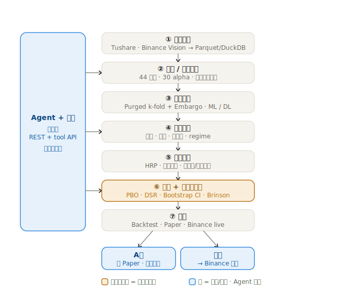

# QuantBT · A股 + 加密的可上线全栈量化软件

> 因子工厂 · ML 模型 (Purged k-fold) · HRP 组合 · BacktestVenue · Binance 实盘 ·
> Agent 工坊 · 一键导出 — 一个仓库一行命令跑通。所有产物以 Parquet/CSV/JSON/MD
> 落盘可独立审计。

终态 spec：[`QuantBT-GOAL.md`](QuantBT-GOAL.md)（1080+ 行，每次决策都追加 v0.x 段，只增不删）

---

## 架构总览

从数据接入到执行的七段流水线 —— Agent 与前端用**同一套 REST + tool API** 驱动；回测阶段强制做 **PBO / DSR / Bootstrap** 过拟合体检（信任门）；**A股**最多到 Paper（不接券商），**加密**走到 Binance 实盘。

<p align="center">
  
</p>

---

## 5 分钟 quickstart（macOS / Linux）

```bash
git clone <repo> quantbt && cd quantbt

# 1. 装依赖
cd app/backend && python -m venv .venv && source .venv/bin/activate
pip install -r requirements.txt
cd ../frontend && npm install && cd ../..

# 2. （可选）填 secrets
cp deploy/secrets.yaml.example ~/.quantbt/secrets.yaml && chmod 600 ~/.quantbt/secrets.yaml
# 编辑 ~/.quantbt/secrets.yaml 填 tushare token / LLM key 等

# 3. 起服务（前端 :5173 后端 :8000）
python -m uvicorn --app-dir app/backend app.main:app --port 8000 &
npm --prefix app/frontend run dev &

# 4. 浏览器打开
open http://localhost:5173/
```

## docker compose 一行命令

```bash
docker compose up -d
# http://127.0.0.1:5173
```

详见 [`docs/installer-guide.md`](docs/installer-guide.md)。

---

## 立即看到的产物

- **5 个 demo run** 入仓可在 RunDetail 直接打开：
  - http://localhost:5173/runs/a_share_real_demo （真 Tushare hs300）
  - http://localhost:5173/runs/a_share_ml_demo （合成）
  - http://localhost:5173/runs/crypto_perp_demo （加密永续）
  - http://localhost:5173/runs/quant1-demo
- **30 个内置 alpha_lite 因子** http://localhost:5173/factors
- **Agent 工作台** 跟真 LLM 对话 http://localhost:5173/agent
- **Binance 交易台** http://localhost:5173/trading
- **策略索引（quantpedia 风）** http://localhost:5173/strategies

---

## 三条硬约束（GOAL §M15 / §12 / §M9.3）

1. **`frontend-run-detail/src/pages/RunDetailPage.tsx` 冻结** — 仅排版 / 显示逻辑 / 加字段
2. **A股不接券商** — 禁止 `import vnpy / easytrader / ths_trader` 等
3. **Binance API key keyring 加密 + 启动校验无 withdraw 权限**

---

## 文档

- [`docs/user-manual.md`](docs/user-manual.md) — 功能总览（按 §4 模块）
- [`docs/secrets-guide.md`](docs/secrets-guide.md) — `~/.quantbt/secrets.yaml` 填写指南
- [`docs/installer-guide.md`](docs/installer-guide.md) — 三种安装方式 + 故障定位
- [`docs/binance-security-guide.md`](docs/binance-security-guide.md) — Binance 实盘安全
- [`docs/data-connector-guide.md`](docs/data-connector-guide.md) — DIY 数据源
- [`docs/strategy-dev-guide.md`](docs/strategy-dev-guide.md) — 写一个策略

---

## 仓库形态

- `app/backend/` — FastAPI + 16 业务模块（connectors/factor_factory/labels/models/signals/portfolio/execution/risk/security/eval/experiments/dag/agent/observability/paper/monitor）
- `app/frontend/` — Vite + React + Claude Code 风 cc-* shell + 5 个独立 workshop 页 + RunDetailPage（jq-* 冻结）
- `examples/` — 3 个端到端 demo（A股合成 / 加密永续 / Tushare 真数据）
- `data/artifacts/experiments/{run_id}/` — 标准 run 目录（run.json / portfolio.csv / trades.csv / metrics.json / report.md）
- `deploy/` — docker / PyInstaller spec / secrets 模板
- `.github/workflows/` — CI 自动打 PyInstaller 包

## 跑测试

```bash
python -m pytest app/backend/tests -q
# 189 passed
```
