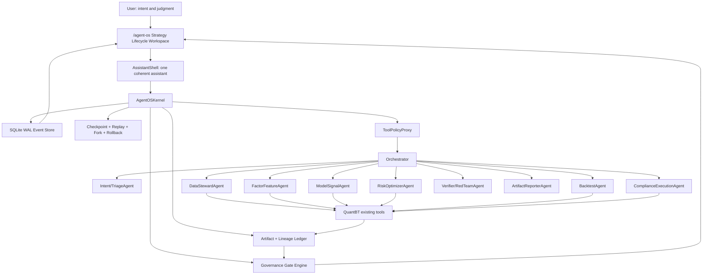

# QuantBT Agent OS Technical Architecture

Status: research draft, implementation-ready  
Date: 2026-06-15  
Scope: Agent OS for non-technical strategy research, institutional quant lifecycle governance, multi-agent orchestration, lineage, trust UI, and execution safety.

## 0. Thesis

Agent OS should not be a larger chat box. It should be a governed strategy operating system:

1. The user sees one coherent assistant and one strategy lifecycle.
2. The backend runs a typed, audited, multi-agent workflow.
3. Every strategy becomes a `GovernedStrategyAsset`, not just a backtest run.
4. Every meaningful action leaves durable state, immutable artifacts, data/model lineage, gate verdicts, and human approval records.
5. The system can explain, replay, fork, roll back, and block.

For QuantBT, this means building a durable Agent OS kernel above the existing modules:

- `agent`: current LLM/tool runtime.
- `dag`: existing mini DAG execution.
- `data_quality` and `data_hash`: dataset version and file manifest foundations.
- `field_catalog`: connector-independent field loading.
- `experiments`: MLflow-lite run/model registry.
- `eval`: PBO, DSR, bootstrap, Brinson/risk summary foundations.
- `execution`, `risk`, `trading`: paper/testnet/live safety surfaces.
- frontend `workshop`, `agent`, `ide`, `RunDetail`, `models`, `training`: current UI pieces to compose into `/agent-os`.

## 1. Reference Model



The kernel is the control plane. QuantBT's existing modules remain the domain engines. The assistant is only the human-facing facade.

## 2. Existing QuantBT Anchors

Important current files:

- `app/backend/app/agent/agent_runtime.py`: simplified ReAct loop with in-memory steps. Good tool-dispatch base, but not durable.
- `app/backend/app/agent/tool_schema.py`: existing tool catalog. Needs governance tools and side-effect policies.
- `app/backend/app/agent/conversations.py`: SQLite chat thread store. Useful for thread binding, but not enough for a kernel ledger.
- `app/backend/app/dag/engine.py`: mini DAG with task statuses, retries, timeout, `idempotency_key` field. Needs durable task state and enforced idempotency.
- `app/backend/app/jobs.py`: in-memory job/SSE store. Needs durable replacement for Agent OS-owned jobs.
- `app/backend/app/experiments/store.py`: append-only experiment/run/model registry. Extend this into inventory, model passport, and recertification rather than creating a parallel registry.
- `app/backend/app/data_quality.py`: dataset version, GE-lite, freshness.
- `app/backend/app/data_hash/dataset_hash.py`: immutable dataset manifests and `FactorBinding`.
- `app/backend/app/field_catalog/contract.py`: `FieldRequirement -> FieldCatalog.load_panel` contract.
- `app/backend/app/models/purged_cv.py`: purged CV support. Training orchestration must require label `t1`.
- `app/backend/app/eval/pbo.py`, `dsr.py`, `bootstrap.py`, `brinson.py`, `risk_summary.py`: validation foundation.
- `app/backend/app/execution/backtest_venue.py`, `execution/base.py`, `risk/checks.py`, `monitor/cost_drift.py`, `trading/safety.py`: execution and monitoring guard foundations.
- `app/frontend/src/pages/workshop/*`, `AgentChatPage.tsx`, `IDEPage.tsx`, `RunDetailPage.tsx`, `models/ModelLibraryPage.tsx`: UI fragments to compose into a real lifecycle workspace.

## 3. Backend Module Layout

Create:

```text
app/backend/app/agent_os/
  __init__.py
  schemas.py
  store.py
  migrations.py
  engine.py
  policy.py
  roles.py
  handoff.py
  gates.py
  lineage.py
  checkpoint.py
  replay.py
  rollback.py
  adapters.py
  api.py
  trust_report.py
```

Responsibilities:

- `schemas.py`: Pydantic models and enums for runs, events, steps, checkpoints, artifacts, handoffs, approvals, gate verdicts.
- `store.py`: SQLite WAL event store plus append-only JSONL audit mirror.
- `engine.py`: `AgentOSKernel`, run state machine, scheduler, recovery, integration with AgentRuntime/DAG/RunStore.
- `policy.py`: tool permissioning, side-effect classes, market boundary, idempotency, approval interrupt generation.
- `roles.py`: role registry and role-to-tool-scope mapping.
- `handoff.py`: typed handoff contract validation.
- `gates.py`: institutional strategy gates and promotion/demotion policy.
- `lineage.py`: dataset/feature/label/model/artifact provenance contracts.
- `checkpoint.py`: atomic checkpoint manifests and hash verification.
- `replay.py`: strict replay, audit replay, live-LLM replay.
- `rollback.py`: compensating rollback; no silent physical deletion.
- `adapters.py`: wrappers around existing QuantBT modules.
- `api.py`: FastAPI router for `/api/agent-os/*`.
- `trust_report.py`: evidence sufficiency report.

## 4. Durable Kernel Store

Use SQLite WAL as the source of truth. JSONL remains an audit export, not the transactional store.

Core tables:

```sql
CREATE TABLE agent_os_runs (
  run_id TEXT PRIMARY KEY,
  thread_id TEXT,
  experiment_id TEXT,
  parent_run_id TEXT,
  forked_from_run_id TEXT,
  root_run_id TEXT,
  goal TEXT NOT NULL,
  status TEXT NOT NULL,
  input_hash TEXT NOT NULL,
  active_checkpoint_id TEXT,
  idempotency_key TEXT UNIQUE,
  lease_owner TEXT,
  lease_expires_at_utc TEXT,
  created_at_utc TEXT NOT NULL,
  updated_at_utc TEXT NOT NULL,
  started_at_utc TEXT,
  finished_at_utc TEXT,
  metadata_json TEXT NOT NULL DEFAULT '{}'
);

CREATE TABLE agent_os_events (
  event_id TEXT PRIMARY KEY,
  run_id TEXT NOT NULL,
  seq INTEGER NOT NULL,
  node_id TEXT,
  event_type TEXT NOT NULL,
  actor TEXT NOT NULL,
  status_from TEXT,
  status_to TEXT,
  causation_id TEXT,
  correlation_id TEXT,
  idempotency_key TEXT,
  payload_json TEXT NOT NULL,
  payload_hash TEXT NOT NULL,
  occurred_at_utc TEXT NOT NULL,
  UNIQUE(run_id, seq),
  UNIQUE(run_id, idempotency_key)
);

CREATE TABLE agent_os_steps (
  step_id TEXT PRIMARY KEY,
  run_id TEXT NOT NULL,
  seq INTEGER NOT NULL,
  kind TEXT NOT NULL,
  node_id TEXT,
  agent_role TEXT,
  tool_name TEXT,
  dag_task_id TEXT,
  attempt INTEGER NOT NULL DEFAULT 1,
  status TEXT NOT NULL,
  input_json TEXT NOT NULL DEFAULT '{}',
  output_json TEXT NOT NULL DEFAULT '{}',
  error_json TEXT,
  checkpoint_id TEXT,
  started_at_utc TEXT,
  finished_at_utc TEXT
);

CREATE TABLE agent_os_checkpoints (
  checkpoint_id TEXT PRIMARY KEY,
  run_id TEXT NOT NULL,
  seq INTEGER NOT NULL,
  step_id TEXT,
  kind TEXT NOT NULL,
  path TEXT NOT NULL,
  sha256 TEXT NOT NULL,
  replayable INTEGER NOT NULL DEFAULT 1,
  manifest_json TEXT NOT NULL,
  created_at_utc TEXT NOT NULL
);

CREATE TABLE agent_os_artifacts (
  artifact_id TEXT PRIMARY KEY,
  run_id TEXT NOT NULL,
  step_id TEXT,
  artifact_type TEXT NOT NULL,
  path TEXT NOT NULL,
  sha256 TEXT,
  row_count INTEGER,
  active INTEGER NOT NULL DEFAULT 1,
  created_at_utc TEXT NOT NULL,
  metadata_json TEXT NOT NULL DEFAULT '{}'
);

CREATE TABLE agent_os_approvals (
  approval_id TEXT PRIMARY KEY,
  run_id TEXT NOT NULL,
  step_id TEXT,
  action_summary TEXT NOT NULL,
  side_effect TEXT NOT NULL,
  risk_level TEXT NOT NULL,
  status TEXT NOT NULL,
  requested_by TEXT NOT NULL,
  reviewer TEXT,
  args_before_json TEXT NOT NULL DEFAULT '{}',
  args_after_json TEXT NOT NULL DEFAULT '{}',
  policy_reason TEXT NOT NULL,
  expires_at_utc TEXT,
  decided_at_utc TEXT,
  created_at_utc TEXT NOT NULL
);

CREATE TABLE agent_os_gate_verdicts (
  verdict_id TEXT PRIMARY KEY,
  run_id TEXT NOT NULL,
  strategy_id TEXT,
  gate_kind TEXT NOT NULL,
  status TEXT NOT NULL,
  severity TEXT NOT NULL,
  evidence_json TEXT NOT NULL,
  reason_codes_json TEXT NOT NULL,
  created_at_utc TEXT NOT NULL
);
```

## 5. State Machines

Kernel run state:

```text
created -> queued -> running -> succeeded
running -> waiting_approval -> running
running -> retry_wait -> running
running -> cancelling -> cancelled
running -> failed
succeeded|failed -> replaying -> succeeded|failed
succeeded|failed|cancelled -> rolling_back -> rolled_back|rollback_failed
terminal -> forked_child_created
```

Strategy lifecycle state:

```text
INTAKE
-> CLARIFYING
-> HYPOTHESIS_DRAFT
-> RESEARCH_REGISTERED
-> DATA_LOCKED
-> FEATURE_LABEL_READY
-> BACKTEST_RUNNING
-> VALIDATION_DOSSIER_READY
-> EVIDENCE_REVIEW
-> APPROVAL_PENDING
-> PAPER_PROBATION
-> TESTNET_PROBATION
-> PRODUCTION_APPROVED
-> WATCHLIST
-> QUARANTINED
-> RETIRED
```

Promotion is one level at a time. Demotion may jump multiple levels. Forking creates a child run; it does not mutate the original terminal record.

## 6. Event Taxonomy

Core events:

```text
RunCreated, RunQueued, RunStarted, RunSucceeded, RunFailed, RunCancelled
NodeScheduled, NodeStarted, NodeSucceeded, NodeFailed, NodeSkipped, NodeTimedOut
LLMRequested, LLMResponded
HandoffRequested, HandoffAccepted, HandoffReturned, HandoffRejected
ToolCallRequested, ToolCallStarted, ToolCallSucceeded, ToolCallFailed
DatasetLocked, FeatureSpecLocked, LabelSpecLocked, ModelVersionLinked
ArtifactDeclared, ArtifactCommitted, ArtifactInvalidated
CheckpointWritten, ReplayStarted, ReplaySucceeded, ReplayDiverged
RollbackStarted, RollbackActionApplied, RollbackSucceeded, RollbackFailed
HumanApprovalRequested, HumanApprovalGranted, HumanApprovalDenied, HumanApprovalEdited
GateEvaluated, GateBlocked, GateWaived, PromotionRequested, PromotionApproved, PromotionRejected
```

High-level product analytics can be derived from these events. The kernel ledger should not depend on the product event service.

## 7. Typed Multi-Agent Protocol

There is only one user-facing assistant. Multi-agent orchestration is internal and typed.

Roles:

- `AssistantShell`: user-facing narrative, clarification, and approval display.
- `Orchestrator`: the only scheduler; maintains task ledger and progress ledger.
- `IntentTriageAgent`: raw intent to `StrategyGoal` and `HypothesisSpec`.
- `DataStewardAgent`: market, universe, timeframe, dataset version, field mapping, freshness.
- `FactorFeatureAgent`: feature/factor specification, IC/RankIC/decay audit.
- `ModelSignalAgent`: model training and `DecisionSnapshot`; cannot create orders.
- `RiskOptimizerAgent`: optimization, risk budgets, no-trade decision.
- `BacktestAgent`: backtest run, fill/slippage/funding/capacity realism.
- `ComplianceExecutionAgent`: A-share paper-only, crypto testnet/live guard.
- `VerifierAgent`: rubric and evidence checks.
- `RedTeamAgent`: prompt injection, tool escalation, market boundary, artifact falsification.
- `ArtifactReporterAgent`: reports from evidence only.

Handoff contract:

```json
{
  "schema_version": "quantbt.agent_handoff.v1",
  "handoff_id": "hof_...",
  "thread_id": "chat_...",
  "parent_run_id": "run_...",
  "from_role": "Orchestrator",
  "to_role": "DataStewardAgent",
  "reason": "need_dataset_scope",
  "state_ref": {
    "checkpoint_id": "chk_...",
    "state_hash": "sha256..."
  },
  "task_contract_ref": "TASK-0001@v1",
  "input_refs": [
    {"kind": "message", "uri": "chat://...", "hash": "sha256..."}
  ],
  "required_output": {
    "type": "DataScopeDecision",
    "json_schema_ref": "schemas/DataScopeDecision.v1"
  },
  "tool_scope": ["data.list_sources", "data.describe_fields"],
  "policy": {
    "side_effect": "read_only",
    "market_scope": ["equity_cn", "crypto_perp"],
    "requires_approval": false
  },
  "budget": {
    "max_steps": 4,
    "max_tokens": 6000,
    "deadline_ms": 120000
  },
  "acceptance": [
    "dataset_version fixed",
    "missing fields explained"
  ],
  "return_to": "Orchestrator"
}
```

Rule: specialists do not talk to each other. They return typed outputs to the Orchestrator. Debate is represented as `Proposal[] + Evidence[] + Verdict`, not free-form chat.

## 8. Tool Policy Proxy

Every tool call goes through `ToolPolicyProxy.invoke(tool_name, args, contract)`.

It enforces:

- JSON schema validation.
- role permission.
- side-effect class: `read_only`, `write_artifact`, `mutate_registry`, `paper_trade`, `testnet_trade`, `live_trade`.
- idempotency key.
- explicit dataset version, no `latest`.
- market boundary: A-share cannot reach live trading.
- side-effect approval.
- rate/cost budget.
- artifact hash and manifest registration.
- redaction of secrets and sensitive fields.
- postcondition validation.

Approval interrupt:

```json
{
  "approval_id": "appr_...",
  "tool_call_id": "tool_...",
  "action_summary": "Run backtest on locked dataset ds_cn_daily@2026-06-15",
  "args_diff": {},
  "side_effect": "write_artifact",
  "risk_level": "medium",
  "policy_reason": "creates experiment artifacts",
  "options": ["approve", "reject", "edit", "defer"],
  "expires_at_utc": "..."
}
```

## 9. Checkpoint, Replay, Fork, Rollback

Checkpoint:

- Write before and after every side-effect boundary.
- Side-effect boundaries include tool call, DAG task, data pull, feature materialization, model training, backtest, artifact commit, model promotion, paper/testnet/live action.
- Write under `data/agent_os/checkpoints/{run_id}/{seq}_{kind}.json`.
- Use temp file, fsync, atomic rename, then record `CheckpointWritten`.

Replay:

- `strict`: verify dataset manifests and replay recorded LLM/tool outputs. No new LLM sampling.
- `audit`: rebuild evidence graph and compare hashes.
- `live_llm`: re-query LLM for investigation only; never equivalent to strict replay.

Rollback:

- Default is compensating rollback: mark artifact/model pointers inactive and restore active checkpoint pointers.
- Do not physically delete original artifacts by default.
- Live or externally visible actions require a compensating action record, not silent deletion.

Fork:

- Create a child run with `forked_from_run_id`, `checkpoint_id`, and `overrides`.
- Reuse `RunStore.create_run(forked_from=...)` lineage semantics.

## 10. Institutional Quant Lifecycle

The product object is:

```text
GovernedStrategyAsset
  strategy_id
  strategy_passport
  research_lineage
  validation_dossier
  model_card
  model_passport
  monitoring_snapshots
  promotion_decisions
```

Required artifacts:

- `strategy_passport.json`: `strategy_id`, `asset_scope`, `frequency`, `hypothesis`, `benchmark`, `intended_use`, `materiality_tier`, `capacity_target`, `allowed_execution`, `owners`, `recertification_cycle`, `kill_switch_policy`.
- `research_lineage.json`: code hash, dataset manifest, universe snapshot, feature/factor bindings, candidate inventory, parameter grid, random seeds, `n_trials`, rejected trials.
- `validation_dossier.json`: purged CV/embargo, walk-forward logs, PBO, DSR, bootstrap confidence interval, White Reality Check, Hansen SPA, Harvey-Liu-Zhu multiple-testing result, stress/reverse stress, capacity/slippage/impact.
- `model_card.json`: purpose, training window, inputs, assumptions, limitations, benchmark exposures, explainability, known failure modes.
- `model_passport.json`: model version, source run, validation dossier id, current stage, approvals, exceptions, monitoring SLA, recertification deadline.
- `monitoring_snapshot.jsonl`: returns, IC decay, turnover, drawdown, cost drift, data freshness, execution rejects, risk breaches.
- `promotion_decision.jsonl`: gate results, machine recommendation, human decision, exception expiry, remediation owner.

Default gates:

- Data gate: dataset hash verified, quality checks pass, freshness acceptable, point-in-time universe declared, no survivorship/lookahead breach.
- Leakage gate: no naked random split; purged CV with `t1` and embargo is mandatory for overlapping labels.
- Statistical gate: PBO <= 0.3 for paper; <= 0.2-0.3 for production; PBO > 0.5 blocks; > 0.6 quarantines.
- DSR gate: DSR >= 0.6 for paper; >= 0.8 for production; < 0.5 blocks; < 0.2 quarantines.
- Multiple-testing gate: White Reality Check / Hansen SPA p <= 0.10 for paper, <= 0.05 for production. New factor claims require higher hurdle, default t-stat >= 3.0 or an approved FDR/q-value threshold.
- Robustness gate: bootstrap Sharpe lower bound positive; OOS degradation > 50% blocks unless explained.
- Economic gate: alpha cannot be fully explained by benchmark/style/factor exposure.
- Capacity gate: pessimistic net alpha positive; impact <= 25% of expected gross alpha; participation <= 5% ADV by default, <= 2% for illiquid names; target AUM <= 80% estimated capacity.
- Monitoring gate: cost drift > 15-20% warns, > 30% demotes; IC decay > 50% or two consecutive material breaches moves to watchlist/demotion.
- Production gate: A-share is research/backtest/paper only; crypto live additionally requires SafeKey, testnet matrix, laddered limits, and kill switch.

Promotion algorithm:

```text
materiality = score(exposure, automation, complexity, client_impact)
evidence = collect_artifacts(strategy_id)
gate_result = evaluate_policy(evidence, materiality)

if hard_fail:
    demote_to(QUARANTINED or RETIRED)
elif monitor_breach_count >= threshold:
    demote_one_or_more_levels()
elif promotion_requested:
    require all hard gates pass
    require consecutive clean monitoring cycles
    require human approvals for target stage
    promote_one_level_only()
else:
    stay_current_stage()

all exceptions require owner, reason, expiry, max_stage, recertification trigger
```

Human judgment is mandatory for materiality, economic plausibility, benchmark choice, model-use boundary, capacity assumptions, exceptions, live activation, vendor reliance, and recertification closure.

Human override is not allowed for hash mismatch, lookahead/leakage, absent candidate inventory for Sharpe claims, missing PBO/DSR on promoted strategies, active kill switch, failed SafeKey/testnet controls, or A-share live prohibition.

## 11. Data, Feature, Label, Experiment Lineage

The key rule: no run may depend on `latest`.

Core contracts:

```text
DatasetVersion:
  dataset_id, version_id, source_name, market, data_kind, interval
  coverage_start_utc, coverage_end_utc, fetched_at_utc
  connector_request_hash, source_snapshot_id, calendar_id
  manifest_hash, logical_content_hash, physical_file_hashes[]
  schema_hash, row_count, ge_status, quality_report_path
  as_of_policy, corporate_action_policy, immutable=true

FeatureSpec:
  feature_spec_id = sha256(canonical_json)
  factor_id, factor_version, formula, formula_ast_hash
  field_requirement, operator_versions, fill_policy, normalization
  dataset_binding: [{dataset_id, version_id}]
  universe_snapshot_id, lookback, min_history, code_hash

LabelSpec:
  label_spec_id = sha256(canonical_json)
  label_type, horizon, t0_col, t1_col
  benchmark_binding, barrier_params, return_basis, leakage_contract

ExperimentPlan:
  plan_id = sha256(canonical_json)
  hypothesis, preregistered_at_utc, owner, status
  universe_spec, dataset_versions, feature_specs, label_specs
  cv_spec, embargo, metrics, promotion_gate
  candidate_space_hash, hidden_trial_budget

CandidateTrial:
  candidate_id, plan_id, params_hash, params
  created_before_first_run, status, run_id
  counts_for_n_trials=true, failure_reason

RunProvenance:
  run_id, experiment_id, plan_id, git_sha, code_hash
  dataset_versions[], feature_set_hash, label_set_hash
  candidates_evaluated[], hidden_trial_count
  metrics, artifact_manifest_hash, parent_run_id, forked_from
```

Necessary hardening:

- `DatasetRegistry.register` should write or verify a `DatasetManifest`.
- Re-registering the same `(dataset_id, version_id)` with different files must fail.
- `RegistryDatasetSource` must require explicit `version_id` for governed runs.
- Fundamentals need `known_at` / `as_of`; `end_date` alone is insufficient.
- All forward labels must produce `t1`; model training must pass `t1` to `purged_kfold`.
- Failed, cancelled, hidden, and rejected trials count toward `n_trials` for DSR/PBO.

Recommended layout:

```text
data/
  lake/market/{market}/{source}/{data_kind}/{interval}/...
  manifests/datasets/{dataset_id}/{version_id}/manifest.json
  catalog/
    inventory.json
    security_master/
    calendars/
    corporate_actions/
    field_catalog.sqlite
  features/specs/{feature_spec_id}.json
  features/materialized/{feature_set_id}/manifest.json
  labels/specs/{label_spec_id}.json
  labels/materialized/{label_set_id}/manifest.json
  experiments/
    plans/{plan_id}.json
    candidates/{plan_id}.jsonl
    experiments.jsonl
    runs.jsonl
    models.jsonl
  artifacts/experiments/{run_id}/
    run.json
    metrics.json
    artifact_manifest.json
    portfolio.csv
    trades.csv
    model.pkl
```

## 12. API Surface

Backend routes:

```text
POST   /api/agent-os/sessions
GET    /api/agent-os/sessions
GET    /api/agent-os/sessions/{session_id}
POST   /api/agent-os/sessions/{session_id}/messages/stream

GET    /api/agent-os/sessions/{session_id}/clarifications
POST   /api/agent-os/sessions/{session_id}/clarifications/answer
PUT    /api/agent-os/sessions/{session_id}/hypothesis

POST   /api/agent-os/runs
GET    /api/agent-os/runs/{run_id}
GET    /api/agent-os/runs/{run_id}/events
GET    /api/agent-os/runs/{run_id}/stream
POST   /api/agent-os/runs/{run_id}/cancel
POST   /api/agent-os/runs/{run_id}/checkpoint
GET    /api/agent-os/runs/{run_id}/checkpoints
POST   /api/agent-os/runs/{run_id}/replay
POST   /api/agent-os/runs/{run_id}/rollback
POST   /api/agent-os/runs/{run_id}/fork

GET    /api/agent-os/runs/{run_id}/ledger
GET    /api/agent-os/runs/{run_id}/trust-report
GET    /api/agent-os/runs/{run_id}/validation-dossier

GET    /api/agent-os/sessions/{session_id}/gates
POST   /api/agent-os/sessions/{session_id}/actions/propose
GET    /api/agent-os/approvals
POST   /api/agent-os/approvals/{approval_id}/approve
POST   /api/agent-os/approvals/{approval_id}/reject
POST   /api/agent-os/approvals/{approval_id}/edit

GET    /api/agent-os/promotion/eligibility
POST   /api/agent-os/promotion/request
POST   /api/agent-os/governance/exception
```

Governance tools to add to `tool_schema.py`:

```text
validation.build_dossier
validation.run_white_reality_check
validation.run_hansen_spa
validation.run_hlz_fdr
inventory.register_strategy
inventory.register_model_passport
governance.request_promotion
governance.record_human_decision
governance.record_exception
monitor.recertify
agent_os.checkpoint
agent_os.replay
agent_os.fork
agent_os.rollback
```

## 13. Frontend Product Architecture

Route: `/agent-os`.

This should be a work surface, not a landing page.

Layout:

```text
Left:    Lifecycle Rail
Center:  Assistant Facade + structured editors
Right:   Evidence Drawer
Bottom:  Approval Inbox + Gate Timeline
```

Components:

- `AgentOSPage`
- `AssistantFacade`
- `ClarificationWizard`
- `HypothesisEditor`
- `StrategyGoalPanel`
- `GateTimeline`
- `ArtifactLedgerViewer`
- `TrustReport`
- `ApprovalInbox`
- `RunReplay`
- `ModelInventoryPanel`
- `PaperLivePromotionGuard`

UI rule:

- Non-technical users see hypothesis, evidence, risk, next decision.
- Economic researchers edit mechanism, benchmark, sample window, constraints.
- JSON/Python is available as advanced inspection, not the primary workflow.
- Chat cannot silently execute write, train, promote, order, or mainnet actions.
- All side effects enter Approval Inbox.
- Trust report never says "safe to live trade"; it says evidence sufficient, evidence insufficient, risk high, or next experiment required.

## 14. Reliability and Security

Crash recovery:

- Enable SQLite WAL.
- All event append and run status mutation happen in one transaction.
- Worker claims use lease fields.
- Expired running leases recover from latest checkpoint.
- No checkpoint means `failed_recoverable`.

Idempotency:

- Every side-effecting step requires an idempotency key.
- `DAGTask.idempotency_key` must become an enforced constraint.
- Duplicate idempotency returns the stored result or blocks divergent args.

Artifact commit:

- Write to `.pending/{run_id}/{step_id}` first.
- Hash and validate.
- Commit event and atomic rename.
- Register in `agent_os_artifacts`.

Prompt/tool security:

- Segregate user text, external web/data text, system policy, and tool results.
- External content is data, never instructions.
- Tool args must be structured and validated.
- Least privilege per role.
- Human approval for irreversible, externally visible, or capital-impacting actions.
- Red-team prompt injection, tool escalation, handoff loop, data poisoning, report fabrication, and market boundary bypass.

## 15. Test Plan

Kernel tests:

- event seq monotonic under concurrent append.
- duplicate idempotency key returns existing event.
- divergent duplicate idempotency key fails.
- lease claim prevents duplicate workers.
- restart recovers from latest checkpoint.
- replay detects dataset hash drift.
- artifact pending file without commit is ignored/recovered.
- rollback does not delete original audit record.

Protocol tests:

- invalid handoff role rejected.
- specialist cannot call tools outside scope.
- specialist cannot hand off directly to another specialist.
- max handoff depth prevents loops.
- ApprovalInterrupt created for write/trade/promote tools.

Lineage tests:

- governed run referencing `latest` fails.
- same dataset version with changed file set fails.
- fundamentals with `end_date <= as_of` but `ann_date > as_of` are invisible.
- forward label without `t1` fails.
- purged CV with `t1` has no train/test overlap.
- hidden/failed/cancelled trials count toward `n_trials`.

Governance tests:

- missing PBO/DSR blocks promotion.
- PBO > 0.5 blocks; PBO > 0.6 quarantines.
- DSR < 0.5 blocks; DSR < 0.2 quarantines.
- OOS degradation > 50% blocks unless exception exists.
- A-share live action always rejected.
- crypto live requires SafeKey, testnet matrix, ladder, and kill switch.
- promotion cannot skip levels.
- demotion can jump.
- exception requires owner, reason, expiry, max stage.

Frontend tests:

- side-effect action appears in Approval Inbox before execution.
- GateTimeline displays pass/fail/blocked/waived with evidence.
- Evidence Drawer shows dataset/model/artifact hashes.
- TrustReport differentiates verified evidence from missing evidence.
- Replay view reconstructs run events in order.

## 16. Implementation Route

Phase 1: Architecture and contracts

- Land this document.
- Add `agent_os/schemas.py` and initial Pydantic contracts.
- Add migration helper and SQLite store.
- Unit test store, event append, idempotency, leases.

Phase 2: Durable AgentRuntime

- Wrap current `AgentRuntime`.
- Convert LLM/tool steps into kernel events.
- Add checkpoint before/after tool calls.
- Preserve existing `/api/agent/chat` while adding `/api/agent-os/runs`.

Phase 3: ToolPolicyProxy and approvals

- Define role registry and tool scopes.
- Gate side effects.
- Add approval table and endpoints.
- Convert write/train/promote/trade actions into approval interrupts.

Phase 4: Lineage gates

- Require explicit dataset version in governed runs.
- Attach DatasetManifest and FactorBinding to run provenance.
- Enforce label `t1` for purged CV.
- Count all candidate trials for DSR/PBO.

Phase 5: Validation dossier and strategy inventory

- Build `validation_dossier` assembler.
- Add White Reality Check, Hansen SPA, HLZ/FDR modules.
- Extend experiment/model registry into strategy passport/model passport.
- Add promotion/demotion policy engine.

Phase 6: Frontend `/agent-os`

- Compose lifecycle workspace from existing Workshop, Agent, IDE, RunDetail, Models.
- Add GateTimeline, Evidence Drawer, Approval Inbox, TrustReport, RunReplay.

Phase 7: Paper/testnet/live guard

- A-share stops at paper.
- Crypto live requires SafeKey, testnet matrix, ladder, kill switch, human approval.
- All externally visible actions require durable approval and trace.

Phase 8: Red-team and eval harness

- Prompt injection tests.
- Tool escalation tests.
- Handoff loop tests.
- Data poisoning tests.
- Artifact fabrication tests.
- Market boundary bypass tests.
- LLM judge bias and report hallucination tests.

## 17. First Vertical Slice

Build this first:

```text
raw user intent
-> ClarificationWizard
-> HypothesisSpec
-> StrategyGoal
-> explicit dataset lock
-> DataGateResult
-> deterministic backtest adapter
-> ValidationDossier with PBO/DSR/bootstrap
-> TrustReport
-> ApprovalQueue decision
-> no live trading
```

This proves the whole Agent OS skeleton without touching live execution.

## 18. External Research Basis

Agent/workflow architecture:

- State-machine workflow grounding: [StateFlow](https://openreview.net/forum?id=3nTbuygoop).
- Orchestrator, task ledger, progress ledger, and sandbox/HITL risk boundaries: [Magentic-One](https://www.microsoft.com/en-us/research/articles/magentic-one-a-generalist-multi-agent-system-for-solving-complex-tasks/).
- Human-in-the-loop tool approval and serialized run resume: [OpenAI Agents SDK HITL](https://openai.github.io/openai-agents-python/human_in_the_loop/).
- Checkpointing, time travel, human-in-the-loop, memory: [LangGraph persistence](https://docs.langchain.com/oss/python/langgraph/persistence).
- Durable workflow/event history/idempotency: [Temporal durable execution](https://temporal.io/blog/idempotency-and-durable-execution).
- Long-running Agents SDK durability: [DBOS OpenAI Agents SDK integration](https://docs.dbos.dev/integrations/openai-agents).
- Prompt injection and LLM application controls: [OWASP LLM01](https://genai.owasp.org/llmrisk/llm01-prompt-injection/).

Institutional quant/model governance:

- Risk-based model risk management, model inventory, effective challenge, validation, monitoring, governance: [Federal Reserve SR 26-2](https://www.federalreserve.gov/supervisionreg/srletters/SR2602.htm).
- Trustworthy AI characteristics and Govern/Map/Measure/Manage: [NIST AI RMF 1.0](https://www.nist.gov/itl/ai-risk-management-framework).
- Investment model validation practices: [CFA Institute Research Foundation](https://rpc.cfainstitute.org/research/foundation/2024/investment-model-validation).
- Deflated Sharpe Ratio: [Bailey and Lopez de Prado](https://www.davidhbailey.com/dhbpapers/deflated-sharpe.pdf).
- White Reality Check: [White 2000](https://www.ssc.wisc.edu/~bhansen/718/White2000.pdf).
- Multiple-testing controls in factor discovery: [Harvey, Liu, Zhu](https://papers.ssrn.com/sol3/papers.cfm?abstract_id=2249314).

Lineage and reproducibility:

- Dataset lineage and reproducibility metadata: [MLflow Dataset Tracking](https://mlflow.org/docs/latest/ml/dataset/).
- Model aliases/tags/registry governance: [MLflow Model Registry](https://mlflow.org/docs/latest/ml/model-registry/).
- Standard run/job/dataset metadata facets: [OpenLineage Facets](https://openlineage.io/docs/spec/facets/).

