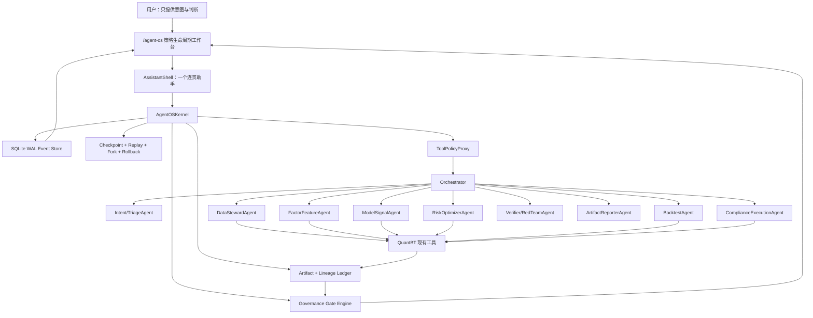

# QuantBT Agent OS 技术架构

状态：研究草案，可进入实现  
日期：2026-06-15  
范围：面向非技术用户的 Agent OS、机构级量化策略生命周期治理、多 agent 编排、数据与模型 lineage、信任界面、执行安全。

## 0. 核心判断

Agent OS 不应该是一个更大的聊天框，而应该是一个被治理的策略操作系统：

1. 用户看到的是一个连贯助手和一个策略生命周期。
2. 底层运行的是类型化、可审计、可恢复的多 agent 工作流。
3. 每个策略都成为一个 `GovernedStrategyAsset`，而不是一次孤立的 backtest run。
4. 每个关键动作都留下 durable state、不可变 artifact、数据/模型 lineage、gate verdict、人类审批记录。
5. 系统必须能解释、重放、fork、回滚、阻断。

对 QuantBT 来说，这意味着在现有模块之上构建一个 durable Agent OS kernel：

- `agent`：当前 LLM/tool runtime。
- `dag`：现有 mini DAG 执行层。
- `data_quality` 与 `data_hash`：dataset version 和文件 manifest 的基础。
- `field_catalog`：connector 无关的字段加载契约。
- `experiments`：MLflow-lite run/model registry。
- `eval`：PBO、DSR、bootstrap、Brinson/risk summary 基础。
- `execution`、`risk`、`trading`：paper/testnet/live 安全边界。
- 前端 `workshop`、`agent`、`ide`、`RunDetail`、`models`、`training`：组合成 `/agent-os` 的现有 UI 片段。

## 1. 参考模型



kernel 是控制平面。QuantBT 现有模块继续作为领域引擎。助手只是人机界面层。

## 2. QuantBT 现有接线点

当前最重要的接线文件：

- `app/backend/app/agent/agent_runtime.py`：简化版 ReAct loop，step 在内存里。适合作为 tool dispatch 基础，但还不是 durable runtime。
- `app/backend/app/agent/tool_schema.py`：现有 tool catalog。需要增加治理工具和 side-effect policy。
- `app/backend/app/agent/conversations.py`：SQLite chat thread store。可用于 thread 绑定，但不足以承担 kernel ledger。
- `app/backend/app/dag/engine.py`：mini DAG，已有 task status、retry、timeout、`idempotency_key` 字段。需要 durable task state 和强制幂等。
- `app/backend/app/jobs.py`：内存 job/SSE store。Agent OS 所有 job 需要 durable 替代。
- `app/backend/app/experiments/store.py`：append-only experiment/run/model registry。应扩展成 inventory、model passport、recertification，而不是另起一套 registry。
- `app/backend/app/data_quality.py`：dataset version、GE-lite、freshness。
- `app/backend/app/data_hash/dataset_hash.py`：不可变 dataset manifest 和 `FactorBinding`。
- `app/backend/app/field_catalog/contract.py`：`FieldRequirement -> FieldCatalog.load_panel` 契约。
- `app/backend/app/models/purged_cv.py`：已有 purged CV 支持。训练编排必须强制传入 label `t1`。
- `app/backend/app/eval/pbo.py`、`dsr.py`、`bootstrap.py`、`brinson.py`、`risk_summary.py`：验证基础。
- `app/backend/app/execution/backtest_venue.py`、`execution/base.py`、`risk/checks.py`、`monitor/cost_drift.py`、`trading/safety.py`：执行与监控 guard 基础。
- `app/frontend/src/pages/workshop/*`、`AgentChatPage.tsx`、`IDEPage.tsx`、`RunDetailPage.tsx`、`models/ModelLibraryPage.tsx`：可组合成真实 lifecycle workspace 的 UI 片段。

## 3. 后端模块布局

新增：

```text
app/backend/app/agent_os/
  __init__.py
  schemas.py
  store.py
  migrations.py
  engine.py
  policy.py
  roles.py
  handoff.py
  gates.py
  lineage.py
  checkpoint.py
  replay.py
  rollback.py
  adapters.py
  api.py
  trust_report.py
```

职责：

- `schemas.py`：runs、events、steps、checkpoints、artifacts、handoffs、approvals、gate verdicts 的 Pydantic models 和 enums。
- `store.py`：SQLite WAL event store，加 append-only JSONL audit mirror。
- `engine.py`：`AgentOSKernel`、run state machine、scheduler、recovery、与 AgentRuntime/DAG/RunStore 集成。
- `policy.py`：tool 权限、side-effect classes、market boundary、idempotency、approval interrupt 生成。
- `roles.py`：role registry 和 role-to-tool-scope 映射。
- `handoff.py`：typed handoff contract 校验。
- `gates.py`：机构级策略 gate 和 promotion/demotion policy。
- `lineage.py`：dataset/feature/label/model/artifact provenance 契约。
- `checkpoint.py`：原子 checkpoint manifest 和 hash 校验。
- `replay.py`：strict replay、audit replay、live-LLM replay。
- `rollback.py`：补偿式 rollback，不做静默物理删除。
- `adapters.py`：对现有 QuantBT 模块的包装层。
- `api.py`：`/api/agent-os/*` FastAPI router。
- `trust_report.py`：证据充分性报告。

## 4. Durable Kernel Store

使用 SQLite WAL 作为事实源。JSONL 只作为审计导出，不作为事务性存储。

核心表：

```sql
CREATE TABLE agent_os_runs (
  run_id TEXT PRIMARY KEY,
  thread_id TEXT,
  experiment_id TEXT,
  parent_run_id TEXT,
  forked_from_run_id TEXT,
  root_run_id TEXT,
  goal TEXT NOT NULL,
  status TEXT NOT NULL,
  input_hash TEXT NOT NULL,
  active_checkpoint_id TEXT,
  idempotency_key TEXT UNIQUE,
  lease_owner TEXT,
  lease_expires_at_utc TEXT,
  created_at_utc TEXT NOT NULL,
  updated_at_utc TEXT NOT NULL,
  started_at_utc TEXT,
  finished_at_utc TEXT,
  metadata_json TEXT NOT NULL DEFAULT '{}'
);

CREATE TABLE agent_os_events (
  event_id TEXT PRIMARY KEY,
  run_id TEXT NOT NULL,
  seq INTEGER NOT NULL,
  node_id TEXT,
  event_type TEXT NOT NULL,
  actor TEXT NOT NULL,
  status_from TEXT,
  status_to TEXT,
  causation_id TEXT,
  correlation_id TEXT,
  idempotency_key TEXT,
  payload_json TEXT NOT NULL,
  payload_hash TEXT NOT NULL,
  occurred_at_utc TEXT NOT NULL,
  UNIQUE(run_id, seq),
  UNIQUE(run_id, idempotency_key)
);

CREATE TABLE agent_os_steps (
  step_id TEXT PRIMARY KEY,
  run_id TEXT NOT NULL,
  seq INTEGER NOT NULL,
  kind TEXT NOT NULL,
  node_id TEXT,
  agent_role TEXT,
  tool_name TEXT,
  dag_task_id TEXT,
  attempt INTEGER NOT NULL DEFAULT 1,
  status TEXT NOT NULL,
  input_json TEXT NOT NULL DEFAULT '{}',
  output_json TEXT NOT NULL DEFAULT '{}',
  error_json TEXT,
  checkpoint_id TEXT,
  started_at_utc TEXT,
  finished_at_utc TEXT
);

CREATE TABLE agent_os_checkpoints (
  checkpoint_id TEXT PRIMARY KEY,
  run_id TEXT NOT NULL,
  seq INTEGER NOT NULL,
  step_id TEXT,
  kind TEXT NOT NULL,
  path TEXT NOT NULL,
  sha256 TEXT NOT NULL,
  replayable INTEGER NOT NULL DEFAULT 1,
  manifest_json TEXT NOT NULL,
  created_at_utc TEXT NOT NULL
);

CREATE TABLE agent_os_artifacts (
  artifact_id TEXT PRIMARY KEY,
  run_id TEXT NOT NULL,
  step_id TEXT,
  artifact_type TEXT NOT NULL,
  path TEXT NOT NULL,
  sha256 TEXT,
  row_count INTEGER,
  active INTEGER NOT NULL DEFAULT 1,
  created_at_utc TEXT NOT NULL,
  metadata_json TEXT NOT NULL DEFAULT '{}'
);

CREATE TABLE agent_os_approvals (
  approval_id TEXT PRIMARY KEY,
  run_id TEXT NOT NULL,
  step_id TEXT,
  action_summary TEXT NOT NULL,
  side_effect TEXT NOT NULL,
  risk_level TEXT NOT NULL,
  status TEXT NOT NULL,
  requested_by TEXT NOT NULL,
  reviewer TEXT,
  args_before_json TEXT NOT NULL DEFAULT '{}',
  args_after_json TEXT NOT NULL DEFAULT '{}',
  policy_reason TEXT NOT NULL,
  expires_at_utc TEXT,
  decided_at_utc TEXT,
  created_at_utc TEXT NOT NULL
);

CREATE TABLE agent_os_gate_verdicts (
  verdict_id TEXT PRIMARY KEY,
  run_id TEXT NOT NULL,
  strategy_id TEXT,
  gate_kind TEXT NOT NULL,
  status TEXT NOT NULL,
  severity TEXT NOT NULL,
  evidence_json TEXT NOT NULL,
  reason_codes_json TEXT NOT NULL,
  created_at_utc TEXT NOT NULL
);
```

## 5. 状态机

Kernel run state：

```text
created -> queued -> running -> succeeded
running -> waiting_approval -> running
running -> retry_wait -> running
running -> cancelling -> cancelled
running -> failed
succeeded|failed -> replaying -> succeeded|failed
succeeded|failed|cancelled -> rolling_back -> rolled_back|rollback_failed
terminal -> forked_child_created
```

策略生命周期 state：

```text
INTAKE
-> CLARIFYING
-> HYPOTHESIS_DRAFT
-> RESEARCH_REGISTERED
-> DATA_LOCKED
-> FEATURE_LABEL_READY
-> BACKTEST_RUNNING
-> VALIDATION_DOSSIER_READY
-> EVIDENCE_REVIEW
-> APPROVAL_PENDING
-> PAPER_PROBATION
-> TESTNET_PROBATION
-> PRODUCTION_APPROVED
-> WATCHLIST
-> QUARANTINED
-> RETIRED
```

promotion 一次只能晋升一级。demotion 可以跨级下调。fork 创建 child run，不改变原始 terminal record。

## 6. Event Taxonomy

核心事件：

```text
RunCreated, RunQueued, RunStarted, RunSucceeded, RunFailed, RunCancelled
NodeScheduled, NodeStarted, NodeSucceeded, NodeFailed, NodeSkipped, NodeTimedOut
LLMRequested, LLMResponded
HandoffRequested, HandoffAccepted, HandoffReturned, HandoffRejected
ToolCallRequested, ToolCallStarted, ToolCallSucceeded, ToolCallFailed
DatasetLocked, FeatureSpecLocked, LabelSpecLocked, ModelVersionLinked
ArtifactDeclared, ArtifactCommitted, ArtifactInvalidated
CheckpointWritten, ReplayStarted, ReplaySucceeded, ReplayDiverged
RollbackStarted, RollbackActionApplied, RollbackSucceeded, RollbackFailed
HumanApprovalRequested, HumanApprovalGranted, HumanApprovalDenied, HumanApprovalEdited
GateEvaluated, GateBlocked, GateWaived, PromotionRequested, PromotionApproved, PromotionRejected
```

产品埋点可以从这些 kernel events 派生。kernel ledger 不应依赖产品事件服务。

## 7. Typed Multi-Agent Protocol

用户面对的始终只有一个助手。多 agent 编排是内部实现，并且必须类型化。

角色：

- `AssistantShell`：用户面对的叙述、澄清、审批展示层。
- `Orchestrator`：唯一调度者；维护 task ledger 和 progress ledger。
- `IntentTriageAgent`：把 raw intent 变成 `StrategyGoal` 和 `HypothesisSpec`。
- `DataStewardAgent`：market、universe、timeframe、dataset version、field mapping、freshness。
- `FactorFeatureAgent`：feature/factor specification、IC/RankIC/decay audit。
- `ModelSignalAgent`：模型训练与 `DecisionSnapshot`；不能直接生成订单。
- `RiskOptimizerAgent`：组合优化、risk budget、no-trade decision。
- `BacktestAgent`：backtest run、fill/slippage/funding/capacity realism。
- `ComplianceExecutionAgent`：A 股 paper-only，crypto testnet/live guard。
- `VerifierAgent`：rubric 和 evidence check。
- `RedTeamAgent`：prompt injection、tool escalation、market boundary、artifact falsification。
- `ArtifactReporterAgent`：只基于证据生成报告。

Handoff contract：

```json
{
  "schema_version": "quantbt.agent_handoff.v1",
  "handoff_id": "hof_...",
  "thread_id": "chat_...",
  "parent_run_id": "run_...",
  "from_role": "Orchestrator",
  "to_role": "DataStewardAgent",
  "reason": "need_dataset_scope",
  "state_ref": {
    "checkpoint_id": "chk_...",
    "state_hash": "sha256..."
  },
  "task_contract_ref": "TASK-0001@v1",
  "input_refs": [
    {"kind": "message", "uri": "chat://...", "hash": "sha256..."}
  ],
  "required_output": {
    "type": "DataScopeDecision",
    "json_schema_ref": "schemas/DataScopeDecision.v1"
  },
  "tool_scope": ["data.list_sources", "data.describe_fields"],
  "policy": {
    "side_effect": "read_only",
    "market_scope": ["equity_cn", "crypto_perp"],
    "requires_approval": false
  },
  "budget": {
    "max_steps": 4,
    "max_tokens": 6000,
    "deadline_ms": 120000
  },
  "acceptance": [
    "dataset_version fixed",
    "missing fields explained"
  ],
  "return_to": "Orchestrator"
}
```

规则：specialist 不互相聊天。specialist 只把 typed output 返回给 Orchestrator。所谓辩论只能表示成 `Proposal[] + Evidence[] + Verdict`，不能变成自由消息流。

## 8. Tool Policy Proxy

所有 tool call 都必须经过 `ToolPolicyProxy.invoke(tool_name, args, contract)`。

它负责强制：

- JSON schema validation。
- role permission。
- side-effect class：`read_only`、`write_artifact`、`mutate_registry`、`paper_trade`、`testnet_trade`、`live_trade`。
- idempotency key。
- 显式 dataset version，禁止 `latest`。
- market boundary：A 股不能进入 live trading。
- side-effect approval。
- rate/cost budget。
- artifact hash 与 manifest registration。
- secrets 和敏感字段脱敏。
- postcondition validation。

Approval interrupt：

```json
{
  "approval_id": "appr_...",
  "tool_call_id": "tool_...",
  "action_summary": "Run backtest on locked dataset ds_cn_daily@2026-06-15",
  "args_diff": {},
  "side_effect": "write_artifact",
  "risk_level": "medium",
  "policy_reason": "creates experiment artifacts",
  "options": ["approve", "reject", "edit", "defer"],
  "expires_at_utc": "..."
}
```

## 9. Checkpoint、Replay、Fork、Rollback

Checkpoint：

- 在每个 side-effect boundary 前后写入。
- side-effect boundary 包括 tool call、DAG task、data pull、feature materialization、model training、backtest、artifact commit、model promotion、paper/testnet/live action。
- 写到 `data/agent_os/checkpoints/{run_id}/{seq}_{kind}.json`。
- 使用 temp file、fsync、atomic rename，然后记录 `CheckpointWritten`。

Replay：

- `strict`：校验 dataset manifests，并重放已记录的 LLM/tool outputs。不能重新采样 LLM。
- `audit`：重建 evidence graph 并比较 hash。
- `live_llm`：只用于调查，可以重新询问 LLM；永远不能等同于 strict replay。

Rollback：

- 默认是补偿式 rollback：把 artifact/model 指针标记 inactive，并恢复 active checkpoint 指针。
- 默认不物理删除原始 artifacts。
- live 或外部可见动作必须留下 compensating action record，不能静默删除。

Fork：

- 创建 child run，记录 `forked_from_run_id`、`checkpoint_id` 和 `overrides`。
- 复用 `RunStore.create_run(forked_from=...)` 的 lineage 语义。

## 10. 机构级量化生命周期

产品对象是：

```text
GovernedStrategyAsset
  strategy_id
  strategy_passport
  research_lineage
  validation_dossier
  model_card
  model_passport
  monitoring_snapshots
  promotion_decisions
```

必需 artifacts：

- `strategy_passport.json`：`strategy_id`、`asset_scope`、`frequency`、`hypothesis`、`benchmark`、`intended_use`、`materiality_tier`、`capacity_target`、`allowed_execution`、`owners`、`recertification_cycle`、`kill_switch_policy`。
- `research_lineage.json`：code hash、dataset manifest、universe snapshot、feature/factor bindings、candidate inventory、parameter grid、random seeds、`n_trials`、rejected trials。
- `validation_dossier.json`：purged CV/embargo、walk-forward logs、PBO、DSR、bootstrap confidence interval、White Reality Check、Hansen SPA、Harvey-Liu-Zhu multiple-testing result、stress/reverse stress、capacity/slippage/impact。
- `model_card.json`：purpose、training window、inputs、assumptions、limitations、benchmark exposures、explainability、known failure modes。
- `model_passport.json`：model version、source run、validation dossier id、current stage、approvals、exceptions、monitoring SLA、recertification deadline。
- `monitoring_snapshot.jsonl`：returns、IC decay、turnover、drawdown、cost drift、data freshness、execution rejects、risk breaches。
- `promotion_decision.jsonl`：gate results、machine recommendation、human decision、exception expiry、remediation owner。

默认 gates：

- Data gate：dataset hash verified、quality checks pass、freshness acceptable、point-in-time universe declared、无 survivorship/lookahead breach。
- Leakage gate：禁止裸 random split；overlapping labels 必须使用带 `t1` 的 purged CV 和 embargo。
- Statistical gate：PBO <= 0.3 才能 paper；<= 0.2-0.3 才能 production；PBO > 0.5 block；> 0.6 quarantine。
- DSR gate：DSR >= 0.6 才能 paper；>= 0.8 才能 production；< 0.5 block；< 0.2 quarantine。
- Multiple-testing gate：White Reality Check / Hansen SPA p <= 0.10 才能 paper，<= 0.05 才能 production。新 factor claim 需要更高门槛，默认 t-stat >= 3.0 或获批的 FDR/q-value threshold。
- Robustness gate：bootstrap Sharpe lower bound 必须为正；OOS degradation > 50% 默认 block，除非有可审计解释。
- Economic gate：alpha 不能完全由 benchmark/style/factor exposure 解释。
- Capacity gate：悲观 net alpha 为正；impact <= expected gross alpha 的 25%；默认 participation <= 5% ADV，illiquid 标的 <= 2%；target AUM <= estimated capacity 的 80%。
- Monitoring gate：cost drift > 15-20% warning，> 30% demotion；IC decay > 50% 或连续两次 material breach 进入 watchlist/demotion。
- Production gate：A 股只能 research/backtest/paper；crypto live 还必须满足 SafeKey、testnet matrix、laddered limits、kill switch。

Promotion algorithm：

```text
materiality = score(exposure, automation, complexity, client_impact)
evidence = collect_artifacts(strategy_id)
gate_result = evaluate_policy(evidence, materiality)

if hard_fail:
    demote_to(QUARANTINED or RETIRED)
elif monitor_breach_count >= threshold:
    demote_one_or_more_levels()
elif promotion_requested:
    require all hard gates pass
    require consecutive clean monitoring cycles
    require human approvals for target stage
    promote_one_level_only()
else:
    stay_current_stage()

all exceptions require owner, reason, expiry, max_stage, recertification trigger
```

必须由人判断：materiality、economic plausibility、benchmark 选择、model-use boundary、capacity assumptions、exceptions、live activation、vendor reliance、recertification closure。

不允许人类 override：hash mismatch、lookahead/leakage、Sharpe claim 缺 candidate inventory、promotion 缺 PBO/DSR、active kill switch、SafeKey/testnet controls 失败、A 股 live prohibition。

## 11. 数据、特征、标签、实验 Lineage

关键规则：任何 run 都不能依赖 `latest`。

核心 contracts：

```text
DatasetVersion:
  dataset_id, version_id, source_name, market, data_kind, interval
  coverage_start_utc, coverage_end_utc, fetched_at_utc
  connector_request_hash, source_snapshot_id, calendar_id
  manifest_hash, logical_content_hash, physical_file_hashes[]
  schema_hash, row_count, ge_status, quality_report_path
  as_of_policy, corporate_action_policy, immutable=true

FeatureSpec:
  feature_spec_id = sha256(canonical_json)
  factor_id, factor_version, formula, formula_ast_hash
  field_requirement, operator_versions, fill_policy, normalization
  dataset_binding: [{dataset_id, version_id}]
  universe_snapshot_id, lookback, min_history, code_hash

LabelSpec:
  label_spec_id = sha256(canonical_json)
  label_type, horizon, t0_col, t1_col
  benchmark_binding, barrier_params, return_basis, leakage_contract

ExperimentPlan:
  plan_id = sha256(canonical_json)
  hypothesis, preregistered_at_utc, owner, status
  universe_spec, dataset_versions, feature_specs, label_specs
  cv_spec, embargo, metrics, promotion_gate
  candidate_space_hash, hidden_trial_budget

CandidateTrial:
  candidate_id, plan_id, params_hash, params
  created_before_first_run, status, run_id
  counts_for_n_trials=true, failure_reason

RunProvenance:
  run_id, experiment_id, plan_id, git_sha, code_hash
  dataset_versions[], feature_set_hash, label_set_hash
  candidates_evaluated[], hidden_trial_count
  metrics, artifact_manifest_hash, parent_run_id, forked_from
```

必要 hardening：

- `DatasetRegistry.register` 必须写入或校验 `DatasetManifest`。
- 同一个 `(dataset_id, version_id)` 如果重新注册出不同文件集合，必须 fail。
- governed runs 中 `RegistryDatasetSource` 必须要求显式 `version_id`。
- fundamentals 需要 `known_at` / `as_of`；只有 `end_date` 不够。
- 所有 forward labels 必须产出 `t1`；model training 必须把 `t1` 传给 `purged_kfold`。
- failed、cancelled、hidden、rejected trials 都要计入 DSR/PBO 的 `n_trials`。

推荐目录：

```text
data/
  lake/market/{market}/{source}/{data_kind}/{interval}/...
  manifests/datasets/{dataset_id}/{version_id}/manifest.json
  catalog/
    inventory.json
    security_master/
    calendars/
    corporate_actions/
    field_catalog.sqlite
  features/specs/{feature_spec_id}.json
  features/materialized/{feature_set_id}/manifest.json
  labels/specs/{label_spec_id}.json
  labels/materialized/{label_set_id}/manifest.json
  experiments/
    plans/{plan_id}.json
    candidates/{plan_id}.jsonl
    experiments.jsonl
    runs.jsonl
    models.jsonl
  artifacts/experiments/{run_id}/
    run.json
    metrics.json
    artifact_manifest.json
    portfolio.csv
    trades.csv
    model.pkl
```

## 12. API Surface

后端 routes：

```text
POST   /api/agent-os/sessions
GET    /api/agent-os/sessions
GET    /api/agent-os/sessions/{session_id}
POST   /api/agent-os/sessions/{session_id}/messages/stream

GET    /api/agent-os/sessions/{session_id}/clarifications
POST   /api/agent-os/sessions/{session_id}/clarifications/answer
PUT    /api/agent-os/sessions/{session_id}/hypothesis

POST   /api/agent-os/runs
GET    /api/agent-os/runs/{run_id}
GET    /api/agent-os/runs/{run_id}/events
GET    /api/agent-os/runs/{run_id}/stream
POST   /api/agent-os/runs/{run_id}/cancel
POST   /api/agent-os/runs/{run_id}/checkpoint
GET    /api/agent-os/runs/{run_id}/checkpoints
POST   /api/agent-os/runs/{run_id}/replay
POST   /api/agent-os/runs/{run_id}/rollback
POST   /api/agent-os/runs/{run_id}/fork

GET    /api/agent-os/runs/{run_id}/ledger
GET    /api/agent-os/runs/{run_id}/trust-report
GET    /api/agent-os/runs/{run_id}/validation-dossier

GET    /api/agent-os/sessions/{session_id}/gates
POST   /api/agent-os/sessions/{session_id}/actions/propose
GET    /api/agent-os/approvals
POST   /api/agent-os/approvals/{approval_id}/approve
POST   /api/agent-os/approvals/{approval_id}/reject
POST   /api/agent-os/approvals/{approval_id}/edit

GET    /api/agent-os/promotion/eligibility
POST   /api/agent-os/promotion/request
POST   /api/agent-os/governance/exception
```

需要加入 `tool_schema.py` 的 governance tools：

```text
validation.build_dossier
validation.run_white_reality_check
validation.run_hansen_spa
validation.run_hlz_fdr
inventory.register_strategy
inventory.register_model_passport
governance.request_promotion
governance.record_human_decision
governance.record_exception
monitor.recertify
agent_os.checkpoint
agent_os.replay
agent_os.fork
agent_os.rollback
```

## 13. 前端产品架构

Route：`/agent-os`。

这应该是工作台，不是 landing page。

布局：

```text
左侧：Lifecycle Rail
中间：Assistant Facade + structured editors
右侧：Evidence Drawer
底部：Approval Inbox + Gate Timeline
```

组件：

- `AgentOSPage`
- `AssistantFacade`
- `ClarificationWizard`
- `HypothesisEditor`
- `StrategyGoalPanel`
- `GateTimeline`
- `ArtifactLedgerViewer`
- `TrustReport`
- `ApprovalInbox`
- `RunReplay`
- `ModelInventoryPanel`
- `PaperLivePromotionGuard`

UI 规则：

- 非技术用户看到的是 hypothesis、evidence、risk、next decision。
- 经济学者可以编辑 mechanism、benchmark、sample window、constraints。
- JSON/Python 作为高级检查入口，不作为主流程。
- chat 不能静默执行 write、train、promote、order、mainnet actions。
- 所有 side effects 进入 Approval Inbox。
- Trust report 不能说“可以放心实盘”；只能说 evidence sufficient、evidence insufficient、risk high、next experiment required。

## 14. 可靠性与安全

Crash recovery：

- 启用 SQLite WAL。
- event append 与 run status mutation 在同一事务中完成。
- worker claims 使用 lease fields。
- expired running leases 从最新 checkpoint 恢复。
- 没有 checkpoint 的 run 标成 `failed_recoverable`。

Idempotency：

- 每个 side-effecting step 都必须有 idempotency key。
- `DAGTask.idempotency_key` 必须升级为强约束。
- duplicate idempotency 返回已存储结果，或在 args divergent 时 block。

Artifact commit：

- 先写入 `.pending/{run_id}/{step_id}`。
- hash 并 validate。
- commit event 后 atomic rename。
- 注册进 `agent_os_artifacts`。

Prompt/tool security：

- 隔离 user text、external web/data text、system policy、tool results。
- external content 是 data，不是 instructions。
- tool args 必须结构化并校验。
- 每个 role 最小权限。
- 不可逆、外部可见、影响资金的动作必须人类审批。
- red-team prompt injection、tool escalation、handoff loop、data poisoning、report fabrication、market boundary bypass。

## 15. 测试计划

Kernel tests：

- event seq 在并发 append 下保持单调。
- duplicate idempotency key 返回 existing event。
- divergent duplicate idempotency key fail。
- lease claim 阻止 duplicate workers。
- restart 从最新 checkpoint recover。
- replay 检测 dataset hash drift。
- artifact pending file 没有 commit 时被 ignore/recover。
- rollback 不删除原始 audit record。

Protocol tests：

- invalid handoff role rejected。
- specialist 不能调用 scope 外 tool。
- specialist 不能直接 handoff 给另一个 specialist。
- max handoff depth 防止 loop。
- write/trade/promote tools 创建 ApprovalInterrupt。

Lineage tests：

- governed run 引用 `latest` fail。
- 同一 dataset version 文件集合变化 fail。
- fundamentals 中 `end_date <= as_of` 但 `ann_date > as_of` 必须不可见。
- forward label 没有 `t1` fail。
- purged CV with `t1` 无 train/test overlap。
- hidden/failed/cancelled trials 计入 `n_trials`。

Governance tests：

- missing PBO/DSR blocks promotion。
- PBO > 0.5 blocks；PBO > 0.6 quarantines。
- DSR < 0.5 blocks；DSR < 0.2 quarantines。
- OOS degradation > 50% blocks unless exception exists。
- A 股 live action always rejected。
- crypto live requires SafeKey、testnet matrix、ladder、kill switch。
- promotion cannot skip levels。
- demotion can jump。
- exception requires owner、reason、expiry、max stage。

Frontend tests：

- side-effect action 在执行前进入 Approval Inbox。
- GateTimeline 展示 pass/fail/blocked/waived 和 evidence。
- Evidence Drawer 展示 dataset/model/artifact hashes。
- TrustReport 区分 verified evidence 和 missing evidence。
- Replay view 按顺序重建 run events。

## 16. 实践路线

Phase 1：架构与 contracts

- 落这份文档。
- 新增 `agent_os/schemas.py` 和初始 Pydantic contracts。
- 新增 migration helper 和 SQLite store。
- 单测 store、event append、idempotency、leases。

Phase 2：Durable AgentRuntime

- 包装当前 `AgentRuntime`。
- 把 LLM/tool steps 转成 kernel events。
- tool call 前后增加 checkpoint。
- 保留现有 `/api/agent/chat`，同时新增 `/api/agent-os/runs`。

Phase 3：ToolPolicyProxy 与 approvals

- 定义 role registry 和 tool scopes。
- gate side effects。
- 新增 approval table 和 endpoints。
- 把 write/train/promote/trade actions 转成 approval interrupts。

Phase 4：Lineage gates

- governed runs 强制显式 dataset version。
- 把 DatasetManifest 和 FactorBinding 接入 run provenance。
- purged CV 强制 label `t1`。
- DSR/PBO 统计所有 candidate trials。

Phase 5：Validation dossier 与 strategy inventory

- 构建 `validation_dossier` assembler。
- 新增 White Reality Check、Hansen SPA、HLZ/FDR modules。
- 把 experiment/model registry 扩展为 strategy passport/model passport。
- 新增 promotion/demotion policy engine。

Phase 6：前端 `/agent-os`

- 从现有 Workshop、Agent、IDE、RunDetail、Models 组合 lifecycle workspace。
- 新增 GateTimeline、Evidence Drawer、Approval Inbox、TrustReport、RunReplay。

Phase 7：Paper/testnet/live guard

- A 股止步 paper。
- Crypto live 必须满足 SafeKey、testnet matrix、ladder、kill switch、human approval。
- 所有外部可见动作必须有 durable approval 和 trace。

Phase 8：Red-team 与 eval harness

- Prompt injection tests。
- Tool escalation tests。
- Handoff loop tests。
- Data poisoning tests。
- Artifact fabrication tests。
- Market boundary bypass tests。
- LLM judge bias 和 report hallucination tests。

## 17. 第一条 Vertical Slice

先构建这一条：

```text
raw user intent
-> ClarificationWizard
-> HypothesisSpec
-> StrategyGoal
-> explicit dataset lock
-> DataGateResult
-> deterministic backtest adapter
-> ValidationDossier with PBO/DSR/bootstrap
-> TrustReport
-> ApprovalQueue decision
-> no live trading
```

这条路径可以证明整个 Agent OS 骨架，不需要触碰 live execution。

## 18. 外部研究依据

Agent/workflow architecture：

- State-machine workflow grounding：[StateFlow](https://openreview.net/forum?id=3nTbuygoop)。
- Orchestrator、task ledger、progress ledger、sandbox/HITL 风险边界：[Magentic-One](https://www.microsoft.com/en-us/research/articles/magentic-one-a-generalist-multi-agent-system-for-solving-complex-tasks/)。
- 人类审批 tool approval 与 serialized run resume：[OpenAI Agents SDK HITL](https://openai.github.io/openai-agents-python/human_in_the_loop/)。
- checkpointing、time travel、human-in-the-loop、memory：[LangGraph persistence](https://docs.langchain.com/oss/python/langgraph/persistence)。
- durable workflow/event history/idempotency：[Temporal durable execution](https://temporal.io/blog/idempotency-and-durable-execution)。
- long-running Agents SDK durability：[DBOS OpenAI Agents SDK integration](https://docs.dbos.dev/integrations/openai-agents)。
- prompt injection 与 LLM application controls：[OWASP LLM01](https://genai.owasp.org/llmrisk/llm01-prompt-injection/)。

Institutional quant/model governance：

- risk-based model risk management、model inventory、effective challenge、validation、monitoring、governance：[Federal Reserve SR 26-2](https://www.federalreserve.gov/supervisionreg/srletters/SR2602.htm)。
- trustworthy AI characteristics 与 Govern/Map/Measure/Manage：[NIST AI RMF 1.0](https://www.nist.gov/itl/ai-risk-management-framework)。
- investment model validation practices：[CFA Institute Research Foundation](https://rpc.cfainstitute.org/research/foundation/2024/investment-model-validation)。
- Deflated Sharpe Ratio：[Bailey and Lopez de Prado](https://www.davidhbailey.com/dhbpapers/deflated-sharpe.pdf)。
- White Reality Check：[White 2000](https://www.ssc.wisc.edu/~bhansen/718/White2000.pdf)。
- factor discovery 中的 multiple-testing controls：[Harvey, Liu, Zhu](https://papers.ssrn.com/sol3/papers.cfm?abstract_id=2249314)。

Lineage and reproducibility：

- dataset lineage 与 reproducibility metadata：[MLflow Dataset Tracking](https://mlflow.org/docs/latest/ml/dataset/)。
- model aliases/tags/registry governance：[MLflow Model Registry](https://mlflow.org/docs/latest/ml/model-registry/)。
- run/job/dataset metadata facets 标准：[OpenLineage Facets](https://openlineage.io/docs/spec/facets/)。

